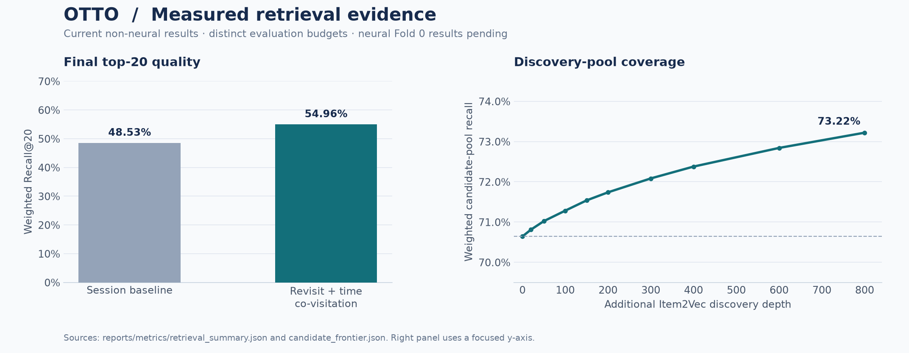
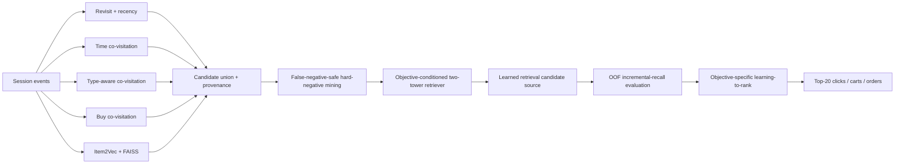
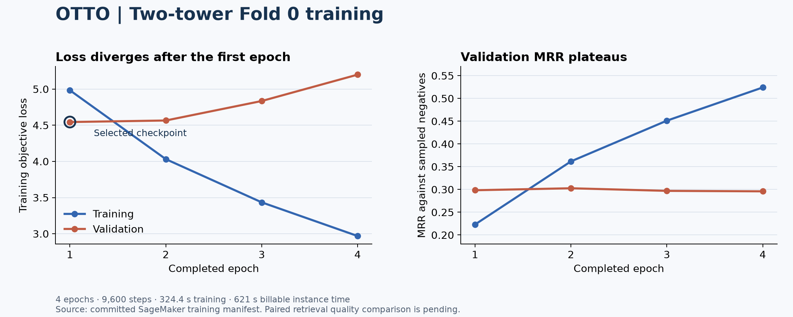
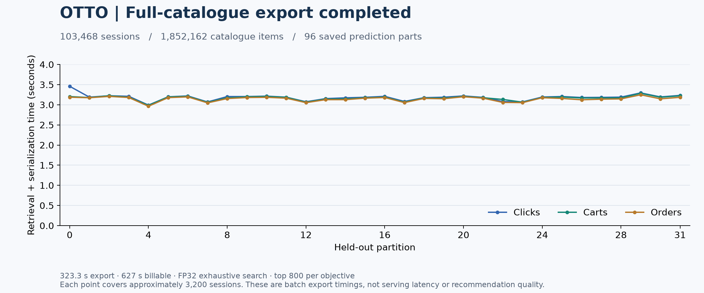
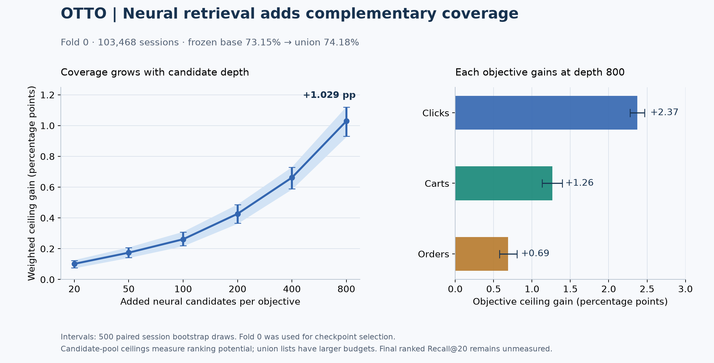
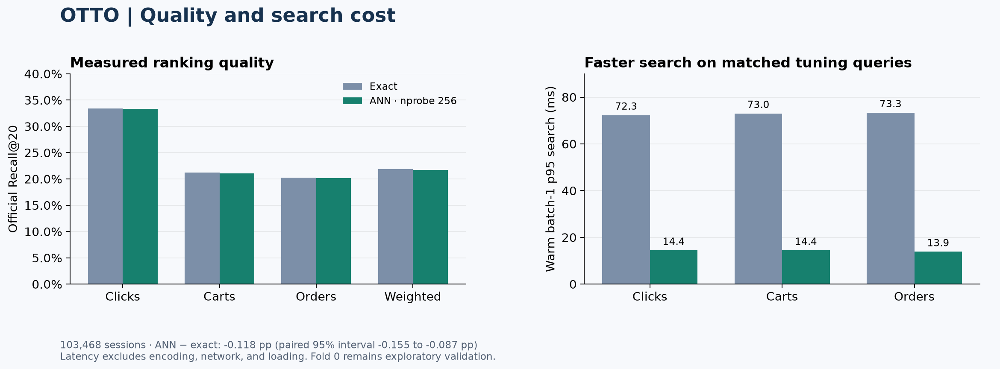

# OTTO Multi-Objective Recommender System

A research-grade, production-oriented implementation of the OTTO session-based recommendation problem, built to demonstrate rigorous recommender-system methodology, large-scale retrieval engineering, reproducibility, and durable AWS training workflows.

The system predicts the next **click**, **cart**, and **order** actions from anonymous session histories. Evaluation follows the competition weighting:

```text
0.10 × Recall@20(clicks) + 0.30 × Recall@20(carts) + 0.60 × Recall@20(orders)
```

## What this repository demonstrates

- temporal, leakage-aware validation rather than random splitting;
- objective-aware retrieval for clicks, carts, and orders;
- session revisit retrieval and multiple co-visitation graphs;
- Item2Vec embeddings and FAISS approximate nearest-neighbor search;
- retrieval ablations and incremental-recall measurement;
- candidate-budget frontier analysis rather than arbitrary candidate counts;
- deterministic five-fold OOF assignment;
- false-negative-safe hard-negative mining;
- an objective-conditioned two-tower neural retriever;
- atomic checkpoints containing model, optimizers, schedulers, RNG state, epoch, batch, and global step;
- S3-backed checkpoint recovery across fresh SageMaker GPU jobs;
- exact-source archive verification with file-level hashes and S3 round-trip parity before paid GPU execution;
- a lockfile-governed CPU dev + ML environment plus exact GPU-package toolchain parity checks, with paid GPU workers reserved for runtime validation and training;
- stage-aware persisted failure diagnostics for SageMaker training jobs;
- structured UTC logging, elapsed-time reporting, CPU/RAM telemetry, GPU/VRAM telemetry, and periodic heartbeats;
- a resumable full-catalogue ANN benchmark with frozen tuning/confirmation queries, official Recall@20, ranking diagnostics, and measured latency;
- Ruff, mypy, pytest, smoke tests, dependency checks, and repository hygiene gates.

## Measured retrieval evidence

| Experiment | Measured result |
|---|---:|
| Baseline weighted Recall@20 | **0.485256** |
| Revisit + time co-visitation weighted Recall@20 | **0.549644** |
| High-budget co-visitation candidate recall | **0.706430** |
| Co-visitation + Item2Vec discovery pool (`k=800`) | **0.732203** weighted candidate recall |

The `k=800` embedding depth is not treated as a final serving budget. Frontier experiments show increasing recall with declining marginal efficiency, so the deep pool is used for discovery and hard-negative mining before learned candidate compression/ranking.



The left panel reports final top-20 quality. The right panel reports candidate-pool coverage at larger discovery depths; these are separate measurements. The independently audited neural Fold 0 comparison appears below; its cohort differs from these earlier all-fold measurements.

## Frozen neural-training corpus

The current neural-retrieval dataset contains:

- **515,702** leakage-safe validation sessions;
- **765,097** session/objective positive rows;
- **64** hard negatives per positive;
- **48,966,208** total hard negatives;
- **0** known future positives incorrectly used as negatives;
- **0** OOF fold mismatches;
- **0** rows containing duplicate hard negatives.

Large artifacts are not committed to Git. They are frozen in S3 with manifests and hashes; compact public summaries live under `reports/metrics/`.

## Architecture



## Portfolio notebooks

The notebooks are intentionally **analysis layers**, not the source of production logic. They read compact committed result artifacts while implementation remains in typed modules and scripts.

1. [`notebooks/01_validation_protocol.ipynb`](notebooks/01_validation_protocol.ipynb) — temporal validation and objective weighting.
2. [`notebooks/02_retrieval_benchmarks.ipynb`](notebooks/02_retrieval_benchmarks.ipynb) — retrieval evidence and ablations.
3. [`notebooks/03_candidate_frontier.ipynb`](notebooks/03_candidate_frontier.ipynb) — candidate-depth trade-offs.
4. [`notebooks/04_hard_negative_quality.ipynb`](notebooks/04_hard_negative_quality.ipynb) — OOF and hard-negative integrity.
5. [`notebooks/05_two_tower_results.ipynb`](notebooks/05_two_tower_results.ipynb) — executed training and resume evidence, exact export, paired retrieval gains with confidence intervals, and the independent count audit.
6. [`notebooks/06_ann_benchmark.ipynb`](notebooks/06_ann_benchmark.ipynb) — executed ANN quality and latency analysis, independently audited metrics, paired confidence intervals, and measured resource use.

## Repository layout

```text
src/otto_recsys/        reusable CPU/data/retrieval library
scripts/                reproducible command-line workflows
gpu/two_tower/          isolated neural-retrieval package
tests/                  root unit/integration/contract tests
notebooks/              employer-facing analytical narrative
docs/                   methodology, architecture, durability, reproducibility
reports/metrics/         compact committed experiment summaries
artifacts/               local recomputable artifacts (not source of truth)
```

## Hermetic Fold 0 integration

Before the Fold 0 source can be committed or any GPU job can be registered,
`scripts/validate_two_tower_fold.py` creates a detached Git worktree and runs
`uv sync --frozen --extra dev --extra ml`, reproducing the complete source-controlled
CPU quality/ML environment instead of a base-only environment. It proves package
provenance, runs the full root gate, verifies the exact GPU-package Ruff/mypy pins,
runs the GPU pytest contract in an isolated exact-version environment, checks
dependency consistency and whitespace, and deletes the worktree. The real
repository is modified only after that clean-room proof passes.

This prevents a configured Studio environment from masking missing development
dependencies or import-path assumptions.

## Quality gate

```bash
uv sync --frozen --extra dev --extra ml
.venv/bin/python scripts/run_quality_gate.py
uv pip check --python .venv/bin/python
git diff --check
```

A normal successful gate runs compilation, Ruff, mypy, pytest, and smoke tests with explicit stage timing.

## Project status

```bash
uv run python scripts/project_status.py
```

## Durability model

Compute is replaceable; state is durable.

- **GitHub**: source, tests, notebooks, docs, compact reports, commit history.
- **S3**: large training data, retrieval artifacts, manifests, hashes, checkpoints, models, evaluations.
- **SageMaker**: managed training execution.
- **CloudWatch**: operational logs and training-job telemetry.

Neural training writes checkpoints to `/opt/ml/checkpoints`, which SageMaker synchronizes to a deterministic S3 prefix. Resume requests fail closed if the checkpoint or immutable input identity does not match.

See [`docs/REPRODUCIBILITY.md`](docs/REPRODUCIBILITY.md), [`docs/DURABILITY.md`](docs/DURABILITY.md), and [`docs/TWO_TOWER_PIPELINE.md`](docs/TWO_TOWER_PIPELINE.md).

## Proven managed resume result

The cross-worker resume proof is complete and committed as a compact public artifact at `reports/metrics/two_tower_resume_proof.json`.

| Resume-proof invariant | Result |
|---|---:|
| Job A durable checkpoint | **PASS** |
| Fresh-worker restore | **PASS** |
| Resumed global step | **40** |
| Final global step | **80** |
| Advanced after restore | **40 steps** |
| Durable checkpoint objects | **7** |
| Durable checkpoint bytes | **2,848,858,963** |

The proof is source-addressed, input-addressed, and server-managed. Closing Studio does not terminate the execution.

## Current modeling stage

**Fold 0 training completed successfully on September 6, 2026.** The run completed four epochs and 9,600 optimizer steps before early stopping. Training took 324.385 seconds; AWS recorded 621 billable instance seconds. The lowest validation loss was 4.544512 at epoch 1.



Validation loss rose after epoch 1 while training loss fell. The saved best checkpoint has now completed exhaustive full-catalogue export: **103,468 held-out sessions, 1,852,162 catalogue items, and 96 prediction parts**, with 800 candidates per objective. Export took 323.287 seconds; AWS recorded 627 billable instance seconds. Prediction files and checksum receipts are stored in S3.



**The paired Fold 0 comparison is complete and independently audited.** All 32 count checkpoints, final metrics, and timestamped logs are durable in S3. The comparator completed in 399.170 seconds, including 331.975 seconds of retained bucket computation.

| Fold 0 measurement | Result |
|---|---:|
| Neural ordered Recall@20 | **21.867%** |
| Frozen baseline candidate-recall ceiling | **73.154%** |
| Baseline + neural top-800 candidate-recall ceiling | **74.184%** |
| Incremental weighted ceiling | **+1.029 percentage points** |
| Paired 95% interval for the increment | **+0.931 to +1.120 percentage points** |
| Additional click / cart / order positive hits | **2,385 / 430 / 138** |



Candidate ceilings measure the maximum top-20 recall an ideal ranker could recover from a larger pool. The union is not a scored or budget-matched top-20 list. Only the neural depth-20 row above is ordered Recall@20. The bootstrap resamples complete sessions, preserving correlations across objectives; it does not account for using Fold 0 to select the checkpoint.

The independent auditor verifies all count receipts and session partitions, then reproduces every point estimate and all 500 paired-bootstrap intervals with a separate aggregation method. Its compact [audit](reports/metrics/two_tower_fold0_audit.json), [UTC log](reports/logs/two_tower_fold0_audit.jsonl), and [original metrics](reports/metrics/two_tower_fold0_retrieval.json) are public. The audit validates saved counts, not a second execution of retrieval from raw labels.

**Decision:** retain the neural model as an additional source. The ANN fidelity and latency benchmark is now complete. Next, measure retained incremental candidate value against the frozen baseline before generating remaining OOF candidates and comparing objective-specific rankers at the same final top-20 budget. An untouched temporal evaluation is still required before a generalization claim. No additional folds are launched by publishing these results.

**Measured ANN result:** three IVFFlat indexes cover 1,852,162 items. `nprobe=256` retained **99.16–99.42%** of exact top-800 neighbors on 2,048 reserved confirmation sessions. Full-fold official weighted Recall@20 was **0.217494**, versus **0.218670** for exact neural retrieval: **−0.118 percentage points**, with a paired 95% interval of **[−0.155, −0.087]** points. Median warm CPU search plus reranking was **5.35–5.63× faster** on matched tuning queries; encoder, network, and loading time are excluded. The run used 3,002 billable seconds and committed all 96 full-fold prediction parts. [Raw report](reports/metrics/two_tower_fold0_ann.json) · [Independent count audit](reports/metrics/two_tower_fold0_ann_audit.json) · [Executed notebook](notebooks/06_ann_benchmark.ipynb).



The fourth managed attempt completed after restoring all 96 compatible reference parts. [Execution evidence](reports/metrics/two_tower_fold0_ann_launch.json) retains the three earlier failures and their causes. Recovery tests use actual boto3 HTTP responses and restore a complete small-model benchmark into a fresh directory; Python warnings fail the worker test suite. The independent production audit verifies 192 count parts, full-fold ranking metrics, the 500-draw paired interval, selection logic, and 18 latency groups. A separate AWS image startup loader warning remains documented. Full-fold ANN incremental gain beyond the baseline is the next measurement.

Start with [the ANN launch and monitoring guide](docs/ANN_BENCHMARK.md). Also see [the completed evaluation and audit](docs/FOLD_EVALUATION.md), [the modeling contract](docs/TWO_TOWER_EXPERIMENTS.md), and [training operations](docs/FOLD_TRAINING.md).
