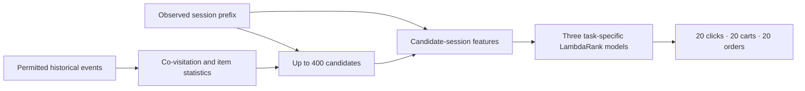

# OTTO · Session-based recommendation

**From anonymous shopping events to three ranked product lists.** An end-to-end recommendation project combining co-visitation retrieval, task-specific learning to rank, temporal validation, controlled feature research, and cloud batch inference.

[](https://github.com/alvaromendizabal/otto-recommender-system/actions/workflows/ci.yml)

**Current verified result:** **0.57140 private / 0.57166 public** on submission **56504354**, scored after the competition deadline. That improves the frozen 0.56842 / 0.56862 reference and the later 0.57100 / 0.57121 objective router. The recorded historical private winning benchmark is **0.60503**, leaving a **0.03363** private-score gap. **Current frontier:** the first supervised-neural integration, residual insertion, nearby cart-threshold search and same-family three-seed order bagging are closed under their gates; richer candidate-to-session similarity aggregation and a materially different GPU XGBoost order family remain active. [Current frontier scorecard](research/frontier/04_competition_frontier.ipynb) · [Submission provenance](docs/INFERENCE.md)

## Start here

| Review path | What it demonstrates |
| --- | --- |
| [Research case study](docs/PORTFOLIO.md) | Problem framing, validation, feature selection, failure slices and engineering tradeoffs |
| [09 · Controlled feature study](notebooks/09_controlled_feature_study.ipynb) | Executed comparisons, ablations, uncertainty and audit evidence |
| [Frontier research review](research/frontier/01_frontier_review.ipynb) | Five completed scoring studies, candidate-coverage diagnosis and decisions |
| [Training scale and recovery](research/frontier/02_training_scale_status.ipynb) | Larger training support, model sealing and checkpoint recovery; later completed and bridged to the established pipeline |
| [03 · Neural frontier](research/neural_stack/03_neural_stack_status.ipynb) | Dated neural-design snapshot and first-place sequence-retrieval adaptation |
| [04 · Competition frontier](research/frontier/04_competition_frontier.ipynb) | Executed current scorecard: verified leaderboard progression, closed hypotheses, active frontier and remaining top-solution gaps |
| [05 · Two-tower results](notebooks/05_two_tower_results.ipynb) and [06 · ANN benchmark](notebooks/06_ann_benchmark.ipynb) | Objective-conditioned neural retrieval and nearest-neighbor experiments |
| [10 · Competition inference](notebooks/10_competition_inference.ipynb) | Frozen native-model replay and verified official-prefix batch delivery |

## The task and architecture

Predict what a shopper will click, add to cart and order next, using only the observed session prefix and permitted history. Input consists of product IDs, timestamps and event types, not product descriptions or user demographics. Output is three ranked lists of 20 products per session.

The [organizer's metric](https://github.com/otto-de/recsys-dataset/blob/main/KAGGLE.md) weights pooled Recall@20 as **10% clicks + 30% carts + 60% orders**. Denominators include capped future targets missing from retrieval. Candidate coverage is an oracle ceiling, never an achieved recommendation score.



## Delivered system and controlled evidence

The original feature study processes **216.7 million training events**, engineers **1,482 feature formulas**, and selects **102 features**. On its **432,492-session reserved temporal cohort**, the selected model reaches **0.584392 weighted Recall@20**, versus **0.564904** for the compact ranker and **0.535244** for candidate fusion. These systems share candidates and evaluation sessions. These are offline results, not Kaggle scores. [Exact evaluation](reports/research/evaluation.json)


The selected representation improves on the compact ranker by **1.949 percentage points**, with a paired 95% session-bootstrap interval of **1.840 to 2.065 points**. Chronological fitting, selection and evaluation roles, frozen artifact identities, and a reconstruction audit support the comparison. Previously explored data and training-seed uncertainty remain limitations. [Validation and failure slices](docs/PORTFOLIO.md)

Full batch inference covers **1,671,803 official test sessions** and **5,015,409 validated prediction rows**. The frozen 102-feature reference scored **0.56842 private / 0.56862 public**. The objective router moved to **0.57100 / 0.57121** by using established fusion outputs for clicks and carts while preserving selected-ranker orders. The current private-score incumbent, submission **56504354**, keeps fusion clicks and selected orders but routes **21+ event cart sessions** to the selected cart ranker, reaching **0.57140 private / 0.57166 public**. A threshold-14 follow-up reached 0.57130 / 0.57168 and was not promoted because private score declined. All are post-deadline measurements; none establishes an official medal or rank. [Inference and provenance](docs/INFERENCE.md)

## Research: test mechanisms, measure outcomes, preserve decisions

The recent studies test timing/training interactions, objective-specific routing, multi-hop retrieval, candidate-aware ranking, explicit path features and learned graph affinities. Their matched controls generally use **134 features**, not the submitted 102-feature system.

The two-hop mechanism increased candidate coverage by **0.023199**, but achieved recall declined. Its tested retraining recipe also regressed. The later timing hybrid and latent-affinity experiments did not establish transferable gains. These findings remain visible in the [executed comparison notebook](research/frontier/01_frontier_review.ipynb), alongside counts, intervals and [selected method implementations](research/frontier/README.md). Different cohorts must not be read as a leaderboard progression.

**Ceiling-escape sequence:** after the 32,768-session pilot lost a same-session bridge to the established 100,000-session pipeline, the project moved into leading-solution mechanisms. The trained task-conditioned neural retriever increased the order candidate ceiling but its first downstream ranker lost **0.006766** weighted selection recall and **38 order hits**; a sparse residual policy then produced at most **+2 fitting-only order hits**, below its +5 gate. A three-seed LightGBM order ensemble also failed to add hits. These branches are closed rather than repeatedly tuned. The active work now tests richer candidate-to-session similarity aggregation and a different GPU XGBoost ranking family. [Current scorecard](research/frontier/04_competition_frontier.ipynb) · [Reproduction matrix](research/neural_stack/reproduction_matrix.json)

## Engineering and publication boundaries

**AWS is the canonical private execution workspace; GitHub is the curated review surface.** The public update includes executed notebooks, aggregate evidence, readable selected implementations and tests. It does not copy raw events, per-session labels or predictions, cohort IDs, full models, embeddings, environments, credentials or account logs.

Content-addressed inputs, atomic receipts, native-model replay, resource bounds and return bundles make long workflows inspectable and restartable. Later frontier runs extend that discipline to reusable neural checkpoints, fitting caches, per-part evaluation receipts, one-upload submission ledgers and explicit stop decisions. Engineering failures are recorded separately from model-quality failures; for example, the current XGBoost branch has no published selection result because its first owner run stopped at a serialization-parity gate after one successful GPU fit.

## Explore and inspect

Foundational notebooks cover [validation](notebooks/01_validation_protocol.ipynb), [retrieval](notebooks/02_retrieval_benchmarks.ipynb), [candidate budgets](notebooks/03_candidate_frontier.ipynb), [hard negatives](notebooks/04_hard_negative_quality.ipynb), [ranking features](notebooks/07_ranking_features.ipynb) and [ranking evaluation](notebooks/08_ranking_evaluation.ipynb). Earlier manual research remains in [research/manual](research/manual/README.md). [Environment and artifact requirements](docs/REPRODUCIBILITY.md)

Important findings are embedded in the saved notebooks as inline Plotly figures and static fallbacks. The [original portable report](https://github.com/alvaromendizabal/otto-recommender-system/raw/refs/heads/main/reports/portfolio/otto-research-report.zip) is supplementary, not a replacement for notebook evidence.

```bash
uv sync --frozen --extra dev --extra ml
.venv/bin/python scripts/run_quality_gate.py
```

**Scope:** the delivered reference system and verified post-competition submission lineage are complete and inspectable; performance research remains open. The current private-score incumbent is **0.57140 private / 0.57166 public**. The historical private winning benchmark of **0.60503** has not been reached. Several neural/routing/bagging hypotheses are now closed, while richer similarity features and a different XGBoost ranking family remain under gated evaluation. The complete winning candidate/ranker ensemble has not been reproduced. No official rank, medal, production-service deployment, or state-of-the-art claim is made.
