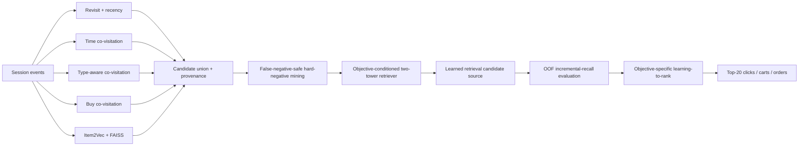

# OTTO Multi-Objective Recommender System

A research-grade, production-oriented implementation of the OTTO session-based recommendation problem, built to demonstrate rigorous recommender-system methodology, large-scale retrieval engineering, reproducibility, and durable AWS training workflows.

The system predicts the next **click**, **cart**, and **order** actions from anonymous session histories. Evaluation follows the competition weighting:

```text
0.10 × Recall@20(clicks) + 0.30 × Recall@20(carts) + 0.60 × Recall@20(orders)
```

## What this repository demonstrates

- temporal, leakage-aware validation rather than random splitting;
- objective-aware retrieval for clicks, carts, and orders;
- session revisit retrieval and multiple co-visitation graphs;
- Item2Vec embeddings and FAISS approximate nearest-neighbor search;
- retrieval ablations and incremental-recall measurement;
- candidate-budget frontier analysis rather than arbitrary candidate counts;
- deterministic five-fold OOF assignment;
- false-negative-safe hard-negative mining;
- an objective-conditioned two-tower neural retriever;
- atomic checkpoints containing model, optimizers, schedulers, RNG state, epoch, batch, and global step;
- S3-backed checkpoint recovery across fresh SageMaker GPU jobs;
- exact-source archive verification with file-level hashes and S3 round-trip parity before paid GPU execution;
- a lockfile-governed CPU dev + ML environment plus exact GPU-package toolchain parity checks, with paid GPU workers reserved for runtime validation and training;
- stage-aware persisted failure diagnostics for SageMaker training jobs;
- structured UTC logging, elapsed-time reporting, CPU/RAM telemetry, GPU/VRAM telemetry, and periodic heartbeats;
- Ruff, mypy, pytest, smoke tests, dependency checks, and repository hygiene gates.

## Measured retrieval evidence

| Experiment | Measured result |
|---|---:|
| Baseline weighted Recall@20 | **0.485256** |
| Revisit + time co-visitation weighted Recall@20 | **0.549644** |
| High-budget co-visitation candidate recall | **0.706430** |
| Co-visitation + Item2Vec discovery pool (`k=800`) | **0.732203** weighted candidate recall |

The `k=800` embedding depth is not treated as a final serving budget. Frontier experiments show increasing recall with declining marginal efficiency, so the deep pool is used for discovery and hard-negative mining before learned candidate compression/ranking.

## Frozen neural-training corpus

The current neural-retrieval dataset contains:

- **515,702** leakage-safe validation sessions;
- **765,097** session/objective positive rows;
- **64** hard negatives per positive;
- **48,966,208** total hard negatives;
- **0** known future positives incorrectly used as negatives;
- **0** OOF fold mismatches;
- **0** rows containing duplicate hard negatives.

Large artifacts are not committed to Git. They are frozen in S3 with manifests and hashes; compact public summaries live under `reports/metrics/`.

## Architecture



## Portfolio notebooks

The notebooks are intentionally **analysis layers**, not the source of production logic. They read compact committed result artifacts while implementation remains in typed modules and scripts.

1. [`notebooks/01_validation_protocol.ipynb`](notebooks/01_validation_protocol.ipynb) — temporal validation and objective weighting.
2. [`notebooks/02_retrieval_benchmarks.ipynb`](notebooks/02_retrieval_benchmarks.ipynb) — retrieval evidence and ablations.
3. [`notebooks/03_candidate_frontier.ipynb`](notebooks/03_candidate_frontier.ipynb) — candidate-depth trade-offs.
4. [`notebooks/04_hard_negative_quality.ipynb`](notebooks/04_hard_negative_quality.ipynb) — OOF and hard-negative integrity.
5. `notebooks/05_two_tower_results.ipynb` — added after neural retrieval evaluation is complete.

## Repository layout

```text
src/otto_recsys/        reusable CPU/data/retrieval library
scripts/                reproducible command-line workflows
gpu/two_tower/          isolated neural-retrieval package
tests/                  root unit/integration/contract tests
notebooks/              employer-facing analytical narrative
docs/                   methodology, architecture, durability, reproducibility
reports/metrics/         compact committed experiment summaries
artifacts/               local recomputable artifacts (not source of truth)
```

## Hermetic Fold 0 integration

Before the Fold 0 source can be committed or any GPU job can be registered,
`scripts/validate_two_tower_fold.py` creates a detached Git worktree and runs
`uv sync --frozen --extra dev --extra ml`, reproducing the complete source-controlled
CPU quality/ML environment instead of a base-only environment. It proves package
provenance, runs the full root gate, verifies the exact GPU-package Ruff/mypy pins,
runs the GPU pytest contract in an isolated exact-version environment, checks
dependency consistency and whitespace, and deletes the worktree. The real
repository is modified only after that clean-room proof passes.

This prevents a configured Studio environment from masking missing development
dependencies or import-path assumptions.

## Quality gate

```bash
uv run python scripts/run_quality_gate.py
uv pip check
git diff --check
```

A normal successful gate runs compilation, Ruff, mypy, pytest, and smoke tests with explicit stage timing.

## Project status

```bash
uv run python scripts/project_status.py
```

## Durability model

Compute is replaceable; state is durable.

- **GitHub**: source, tests, notebooks, docs, compact reports, commit history.
- **S3**: large training data, retrieval artifacts, manifests, hashes, checkpoints, models, evaluations.
- **SageMaker**: managed training execution.
- **CloudWatch**: operational logs and training-job telemetry.

Neural training writes checkpoints to `/opt/ml/checkpoints`, which SageMaker synchronizes to a deterministic S3 prefix. Resume requests fail closed if the checkpoint or immutable input identity does not match.

See [`docs/REPRODUCIBILITY.md`](docs/REPRODUCIBILITY.md), [`docs/DURABILITY.md`](docs/DURABILITY.md), and [`docs/TWO_TOWER_PIPELINE.md`](docs/TWO_TOWER_PIPELINE.md).

## Proven managed resume result

The cross-worker resume proof is complete and committed as a compact public artifact at `reports/metrics/two_tower_resume_proof.json`.

| Resume-proof invariant | Result |
|---|---:|
| Job A durable checkpoint | **PASS** |
| Fresh-worker restore | **PASS** |
| Resumed global step | **40** |
| Final global step | **80** |
| Advanced after restore | **40 steps** |
| Durable checkpoint objects | **7** |
| Durable checkpoint bytes | **2,848,858,963** |

The proof is source-addressed, input-addressed, and server-managed. Closing Studio does not terminate the execution.

## Current modeling stage

Infrastructure validation is complete. The next authorized experiment is **one full OOF Fold 0 neural-retrieval run** using `scripts/launch_two_tower_fold.py`.

Fold 0 is trained on folds 1–4, writes durable resumable checkpoints, and publishes a compact training report. The learned retriever is then evaluated at candidate depths 20/50/100/200/400/800 for standalone recall, incremental recall over the frozen co-visitation + Item2Vec system, and neural-only positive hits.

Additional neural folds are blocked until Fold 0 demonstrates complementary held-out value. See `docs/TWO_TOWER_EXPERIMENTS.md`.
