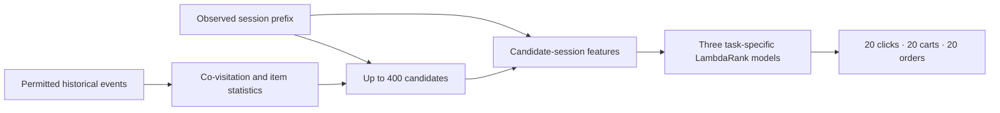

# OTTO · Session-based recommendation

**From anonymous shopping events to three ranked product lists.** An end-to-end recommendation project combining co-visitation retrieval, task-specific learning to rank, temporal validation, controlled feature research, and cloud batch inference.

[](https://github.com/alvaromendizabal/otto-recommender-system/actions/workflows/ci.yml)

**Delivered baseline:** 0.56842 private / 0.56862 public, accepted after the competition deadline. **Research update, September 21, 2026, 8:09 PM Pacific:** all three larger-training rankers are complete; 15,936 of 16,384 evaluation sessions are checkpointed. The bounded run paused with 448 sessions remaining. No final scale-up score or new submission is claimed. [Current executed review](research/frontier/02_training_scale_status.ipynb) · [Submission provenance](docs/INFERENCE.md)

## Start here

| Review path | What it demonstrates |
| --- | --- |
| [Research case study](docs/PORTFOLIO.md) | Problem framing, validation, feature selection, failure slices and engineering tradeoffs |
| [09 · Controlled feature study](notebooks/09_controlled_feature_study.ipynb) | Executed comparisons, ablations, uncertainty and audit evidence |
| [Frontier research review](research/frontier/01_frontier_review.ipynb) | Five completed scoring studies, candidate-coverage diagnosis and decisions |
| [Training scale and recovery](research/frontier/02_training_scale_status.ipynb) | Larger training support, model sealing, checkpoint completeness and the pending decision |
| [05 · Two-tower results](notebooks/05_two_tower_results.ipynb) and [06 · ANN benchmark](notebooks/06_ann_benchmark.ipynb) | Objective-conditioned neural retrieval and nearest-neighbor experiments |
| [10 · Competition inference](notebooks/10_competition_inference.ipynb) | Frozen native-model replay and verified official-prefix batch delivery |

## The task and architecture

Predict what a shopper will click, add to cart and order next, using only the observed session prefix and permitted history. Input consists of product IDs, timestamps and event types, not product descriptions or user demographics. Output is three ranked lists of 20 products per session.

The [organizer's metric](https://github.com/otto-de/recsys-dataset/blob/main/KAGGLE.md) weights pooled Recall@20 as **10% clicks + 30% carts + 60% orders**. Denominators include capped future targets missing from retrieval. Candidate coverage is an oracle ceiling, never an achieved recommendation score.



## Delivered system and controlled evidence

The original feature study processes **216.7 million training events**, engineers **1,482 feature formulas**, and selects **102 features**. On its **432,492-session reserved temporal cohort**, the selected model reaches **0.584392 weighted Recall@20**, versus **0.564904** for the compact ranker and **0.535244** for candidate fusion. These systems share candidates and evaluation sessions. These are offline results, not Kaggle scores. [Exact evaluation](reports/research/evaluation.json)


The selected representation improves on the compact ranker by **1.949 percentage points**, with a paired 95% session-bootstrap interval of **1.840 to 2.065 points**. Chronological fitting, selection and evaluation roles, frozen artifact identities, and a reconstruction audit support the comparison. Previously explored data and training-seed uncertainty remain limitations. [Validation and failure slices](docs/PORTFOLIO.md)

Full batch inference covers **1,671,803 official test sessions** and **5,015,409 validated prediction rows**. The accepted score is **0.56842 private / 0.56862 public**. An earlier result was invalidated after its input was found to contain future events; the corrected official-prefix result supersedes it. The incident and remediation remain documented. [Inference and provenance](docs/INFERENCE.md)

## Research: test mechanisms, measure outcomes, preserve decisions

The recent studies test timing/training interactions, objective-specific routing, multi-hop retrieval, candidate-aware ranking, explicit path features and learned graph affinities. Their matched controls generally use **134 features**, not the submitted 102-feature system.

The two-hop mechanism increased candidate coverage by **0.023199**, but achieved recall declined. Its tested retraining recipe also regressed. The later timing hybrid and latent-affinity experiments did not establish transferable gains. These findings remain visible in the [executed comparison notebook](research/frontier/01_frontier_review.ipynb), alongside counts, intervals and [selected method implementations](research/frontier/README.md). Different cohorts must not be read as a leaderboard progression.

**Current experiment:** nested training grows from **8,192 to 32,768 sessions** while keeping candidates, 134 features and the model recipe fixed. It retains 498,404 original sampled rows inside **1,993,202 total rows**. Order queries containing positive and negative candidates increase from **685 to 2,644**. All three new models are sealed; **249 of 256 evaluation chunks** are committed. Training support is not a performance claim. The next step is to reuse checkpoints and finish evaluation, not retrain. [Executed status and support analysis](research/frontier/02_training_scale_status.ipynb) · [Aggregate snapshot](research/frontier/training_scale_status.json)

## Engineering and publication boundaries

**AWS is the canonical private execution workspace; GitHub is the curated review surface.** The public update includes executed notebooks, aggregate evidence, readable selected implementations and tests. It does not copy raw events, per-session labels or predictions, cohort IDs, full models, embeddings, environments, credentials or account logs.

Content-addressed inputs, atomic receipts, native-model replay, resource bounds and return bundles make long workflows inspectable and restartable. A real replay-interface defect was corrected before this successful training run. The latest stop is a planned deadline pause, not a recurrence of that defect. An additional synthetic interruption test verifies reuse of completed models and training chunks and generation of only the missing evaluation chunk. It does not establish real-data predictive quality.

## Explore and inspect

Foundational notebooks cover [validation](notebooks/01_validation_protocol.ipynb), [retrieval](notebooks/02_retrieval_benchmarks.ipynb), [candidate budgets](notebooks/03_candidate_frontier.ipynb), [hard negatives](notebooks/04_hard_negative_quality.ipynb), [ranking features](notebooks/07_ranking_features.ipynb) and [ranking evaluation](notebooks/08_ranking_evaluation.ipynb). Earlier manual research remains in [research/manual](research/manual/README.md). [Environment and artifact requirements](docs/REPRODUCIBILITY.md)

Important findings are embedded in the saved notebooks as inline Plotly figures and static fallbacks. The [original portable report](https://github.com/alvaromendizabal/otto-recommender-system/raw/refs/heads/main/reports/portfolio/otto-research-report.zip) is supplementary, not a replacement for notebook evidence.

```bash
uv sync --frozen --extra dev --extra ml
.venv/bin/python scripts/run_quality_gate.py
```

**Scope:** baseline delivery is complete and inspectable; performance research remains open. No recent challenger has been promoted or submitted. The historical private winning benchmark of **0.60503** has not been reached. No official rank, production-service deployment, or complete winning-solution reproduction is claimed.
