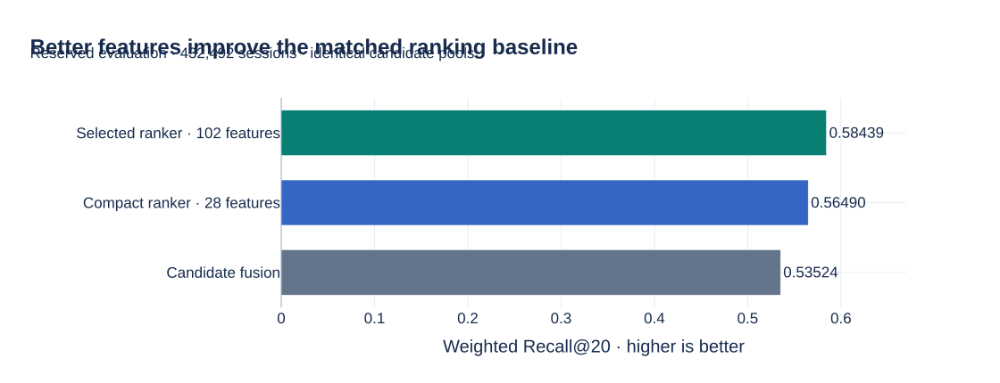
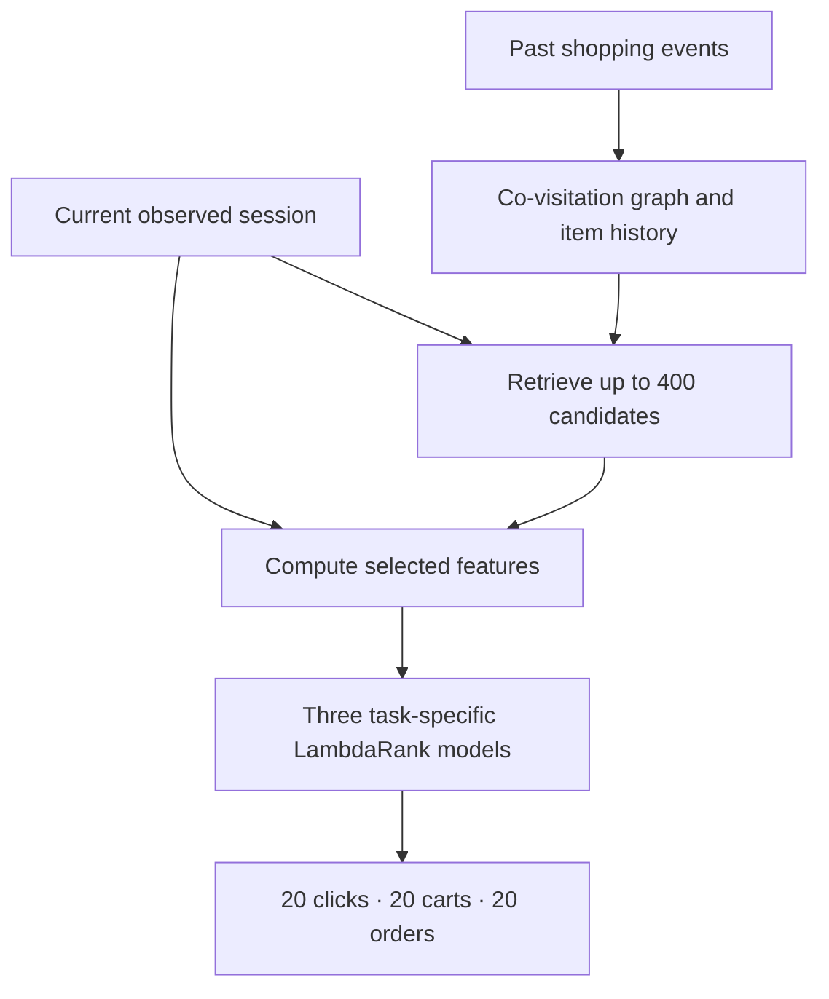
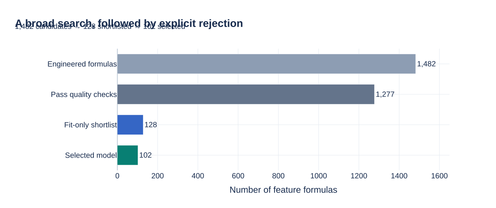
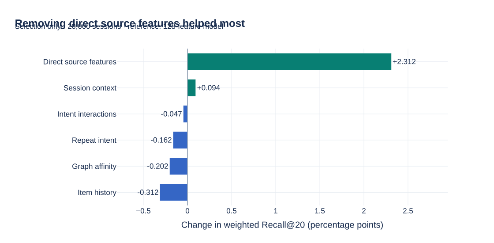
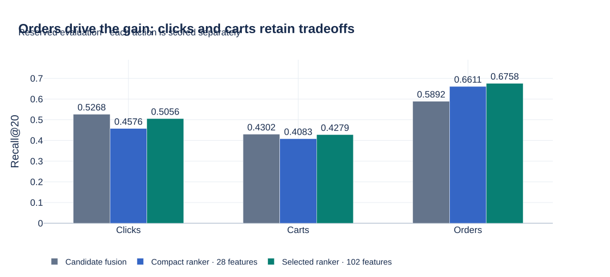
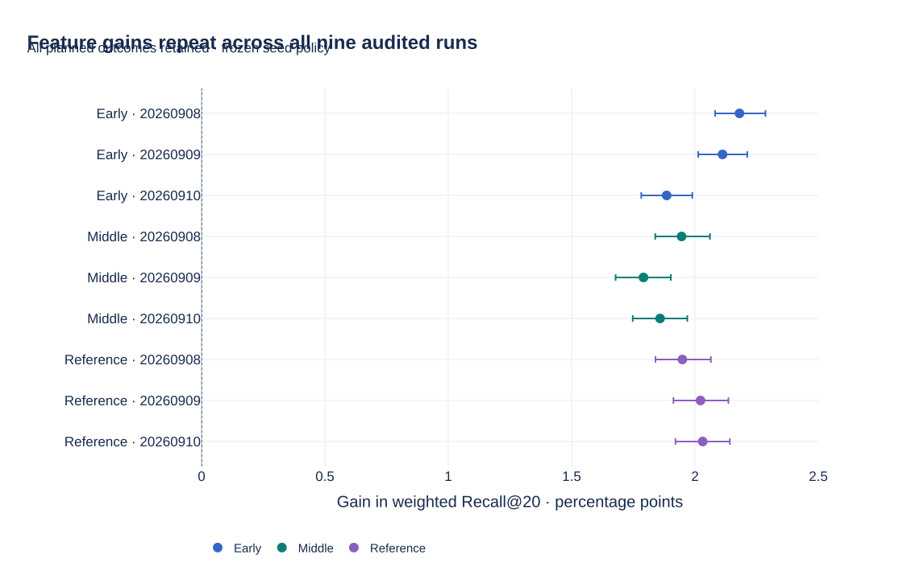

# OTTO · Session-based recommendation

**Baseline delivered; performance research active.** Nine temporal validation runs are audited, and the official-prefix submission scores **0.56842 private / 0.56862 public**. The historical winning private score is **0.60503**. The next controlled experiment tests learned item/session similarity features under the same chronological protocol. [Results and research plan](docs/ROADMAP.md).

**Predict what a shopper will click, add to cart, and order next.**

A complete recommendation pipeline built around one research question:
**how much can a carefully tested feature representation improve ranking quality?**
The project combines large-scale event processing, candidate retrieval, learning to rank,
controlled experiments, and reproducible cloud inference.

[](https://github.com/alvaromendizabal/otto-recommender-system/actions/workflows/ci.yml)

[Research case study](docs/PORTFOLIO.md) ·
[Executed notebooks](#explore-the-work) ·
[Interactive Plotly report · ZIP ↓](https://github.com/alvaromendizabal/otto-recommender-system/raw/refs/heads/main/reports/portfolio/otto-research-report.zip) ·
[Reproduce the results](docs/REPRODUCIBILITY.md)

| Data processed | Feature research | Evaluation | Batch inference |
|:---|:---|:---|:---|
| **216.7 million** training events | **1,482 → 102** features | **432,492** reserved sessions | **1.67 million** test sessions |
| 217 verified event partitions | Six families; 24 model fits | Chronological, with paired uncertainty | 5,015,409 validated prediction rows |



**The result:** the selected ranker reaches **0.58439 weighted Recall@20**, improving
on the compact ranker by **1.949 percentage points** and candidate fusion by **4.915 points**.
The comparisons use the same candidate pools and evaluation sessions. These are
**offline temporal-validation results**.

**Competition delivery:** Kaggle accepted the verified official-prefix predictions and
reported **0.56842 private / 0.56862 public**. The original 0.93583 private score is
invalidated because its input included future events. [Accepted result and source audit →](docs/INFERENCE.md)

*Every chart is generated with Plotly from the committed, verified experiment reports.
GitHub displays the SVG previews. For hover values, zoom, model toggles, and exact-value
tables, download the ZIP above, extract it, and open `otto-research-report.html` in a browser.
The report includes Plotly and works offline.*

## The problem, in plain language

A shopper might view a product, compare several alternatives, and add one to a cart.
At that point, the system sees only the actions already taken. It returns **three ranked
lists of 20 product IDs**: likely next clicks, future cart additions, and future orders.
A click expresses interest; a cart addition and an order express different levels of intent.
Separate models let the system learn those differences.

The data contains anonymous session IDs, product IDs, timestamps, and action types.
There are no product descriptions or demographic profiles to rely on. Useful signals must
come from **which products appear together, what the shopper revisits, how recently actions
occurred, and how item demand changes over time**.

The [official task](https://github.com/otto-de/recsys-dataset/blob/main/KAGGLE.md) uses
weighted Recall@20: **10% clicks + 30% carts + 60% orders**. Recall measures how much of the
future ground truth appears in the recommendation lists. The implementation pools hits
and capped target counts within each action; a product missed during retrieval still
counts against the final score. See the [metric explanation](docs/PORTFOLIO.md#how-to-read-the-score)
for a worked example.

## How the system works



**Retrieval narrows the search.** Co-visitation connects products that occur near each
other in historical sessions. Three graph channels capture general transitions, cart
intent, and purchase intent. Session revisits and historical popularity add candidates.

**Features describe relevance.** Each candidate receives measurements of historical demand,
repeat interest, graph affinity, session context, and interactions between these signals.

**Ranking chooses the order.** Three LightGBM LambdaRank models learn which candidates should
appear near the top for each action. The selected feature schema is shared; the learned
ranking functions differ.

The repository also contains an **objective-conditioned neural two-tower retriever** and
**exact/approximate nearest-neighbor benchmarks**. Those are separately measured experiments
in [Notebooks 05–06](notebooks/05_two_tower_results.ipynb). The controlled result above uses
retrievers refitted within its own permitted historical window; it does not reuse the older
neural checkpoint. [Architecture and research decisions →](docs/PORTFOLIO.md#why-retrieval-and-ranking-are-separate)

## Feature engineering as an experiment

The feature search starts from hypotheses about shopping behavior, then tests which
representations are useful. For example, a recently revisited item may indicate intent;
a graph score measures its relationship to the basket; historical rate features distinguish
rising demand from total popularity.



| Family | Question it helps answer | Engineered | Final |
|:---|:---|---:|---:|
| Historical item context | Is this item popular now, growing, or associated with purchases? | 99 | 57 |
| Session context | Is this a brief visit, a broad comparison, or a concentrated shopping session? | 24 | 19 |
| Repeat intent | Has this shopper returned to the candidate, and how recently? | 160 | 17 |
| Graph affinity | How strongly is the candidate connected to the observed session? | 1,152 | 5 |
| Intent interactions | Does item affinity agree with the shopper's current intent? | 11 | 4 |
| Direct retrieval-source features | Which retrieval sources proposed the item, with what scores and ranks? | 36 | 0 |
| **Total** | | **1,482** | **102** |

Quality checks remove constant, near-constant, and duplicated columns. Three session-grouped
fitting folds provide utility and stability diagnostics. Correlation pruning and a predeclared
capacity limit produce a 128-feature shortlist. Every formula and rejection reason remains
inspectable in the [feature catalog](reports/research/feature_catalog.csv).

**The strongest finding came from removing features.** Eight configurations share the same
fitting queries, candidate pools, negative samples, model settings, and stopping rule.
Each configuration fits a model for all three actions: **24 actual model fits**.



Removing the 26 shortlisted direct source features increased the **selection** score from
**0.57640 to 0.59952**. That 102-feature configuration won all three action-specific selection
comparisons and was frozen before final evaluation. Removing context helped slightly;
removing history, graph, repeat, or interaction features hurt the 128-feature reference.
Graph and interaction features still contain retrieval information.

This is evidence for the tested representation and selection procedure. It does not mean
that every rejected feature is universally useless, or that every individual retained feature
has an independently measured benefit. [Full ablation results and interpretation →](docs/PORTFOLIO.md#what-the-ablation-actually-shows)

## Results, uncertainty, and tradeoffs



| Evaluation metric | Candidate fusion | Compact · 28 features | Selected · 102 features |
|:---|---:|---:|---:|
| Click Recall@20 | **0.526781** | 0.457558 | 0.505645 |
| Cart Recall@20 | **0.430211** | 0.408325 | 0.427919 |
| Order Recall@20 | 0.589171 | 0.661085 | **0.675753** |
| **Weighted Recall@20** | 0.535244 | 0.564904 | **0.584392** |

**Orders drive the weighted improvement.** The selected model improves every action over
the compact ranker, while fusion still has the highest click and cart recall. No hybrid was
selected after looking at evaluation results. The candidate pool's weighted ceiling is
**0.686951**: it measures target coverage available to an ideal ranking, not an achieved score.

| Selected ranker compared with | Gain | Paired 95% interval |
|:---|---:|---:|
| Compact ranker | **+1.949 pp** | +1.840 to +2.065 pp |
| Candidate fusion | **+4.915 pp** | +4.697 to +5.136 pp |

The intervals use **1,000 paired session bootstrap samples**. They describe sampling
variation for these frozen models on this cohort; they do not measure training-seed
variation. The compact comparison supports a feature-representation improvement under
matched training settings and the same stopping rule, rather than an isolated causal
estimate for each feature.

The model also has a visible failure slice: for sessions with **2–5 observed events**, it
scores **0.59704 versus fusion's 0.59972**. The [case study](docs/PORTFOLIO.md#where-the-system-struggles)
shows this alongside the stronger gains on longer sessions.
[Exact evaluation evidence →](reports/research/evaluation.json)

## Why the evaluation is defensible

The experiment respects the order in which information becomes available.

| Stage | Time window in August 2022, UTC | What it can decide |
|:---|:---|:---|
| Historical retrieval | Before Aug 20, 22:00 | Graph edges and historical item statistics |
| Fit · 100,000 sessions | Aug 20, 22:00 → Aug 23, 22:00 | Feature screening and model fitting |
| Select · 20,000 sessions | Aug 23, 22:00 → Aug 24, 22:00 | Feature configuration and stopping iteration |
| Evaluate · 432,492 sessions | Aug 24, 22:00 → Aug 26, 22:00 | Report the frozen models' performance |

Windows include their start and exclude their end. Whole sessions receive a role from
their first event, and events are clipped at that role's end. A label-independent cut
separates the observed prefix from future targets. A saved selection record binds the
chosen feature order, models, data, and retrieval identity before evaluation begins.

A separate auditor reconstructs **all observed prefixes and 788,883 target records** from
**217 original Parquet partitions**, finding zero discrepancies. It checks all 24 native
models, recomputes pooled metrics, and reproduces **4,608 sampled prediction/candidate
checks plus 6,912 supporting ranking-metric checks**.

The audit shares the frozen feature implementation and does not independently replay the
original raw JSONL conversion. Earlier experiments had already exposed the underlying OTTO
dataset, so this is a **newly reserved temporal cohort**, not a never-inspected dataset.
[Protocol](docs/RESEARCH.md) · [Audit implementation](src/otto_recsys/research/audit.py) ·
[Audit results](reports/research/audit.json)

## From research to a reproducible deliverable

The selected representation also reduces feature computation: matched warm **p95 falls from
22.10 ms to 6.42 ms** versus the broad catalog. The measurement includes candidate generation
and features on 64 queries; it excludes model prediction, networking, and online serving.
[Timing chart and methodology →](docs/PORTFOLIO.md#what-the-runtime-measurement-means)

The implementation provides typed Python modules, locked environments, automated contract
tests, UTC progress logs, native model checkpoints, atomic partition receipts, and SHA-256
validation. Interrupted jobs reuse valid completed work. Tests cover corruption, partial
writes, incompatible inputs, missing partitions, and duplicate writers.

**Full official-prefix inference is complete and independently verified.**
The 289,541,110-byte gzip contains 5,015,409 rows covering all 1,671,803 sessions.
Notebook 10 replays the corrected output. The original 0.93583 private Kaggle score
is invalidated because that earlier input contained future events; it is not a
performance claim. The corrected file is accepted and scored at **0.56842 private / 0.56862 public**.
[Source correction and replacement workflow →](docs/INFERENCE.md)

To run the repository's checks from a clone:

```bash
uv sync --frozen --extra dev --extra ml
.venv/bin/python scripts/run_quality_gate.py
```

The [reproducibility guide](docs/REPRODUCIBILITY.md) includes notebook replay, figure
regeneration, full experiment commands, resource requirements, and recovery behavior.
Reading the saved notebooks and charts requires neither the full dataset nor AWS access.

## Explore the work

| Review path | What to inspect |
|:---|:---|
| **Understand the decisions** | [Research case study](docs/PORTFOLIO.md): worked metric example, leakage boundaries, feature hypotheses, ablations, explanations, and failure analysis |
| **Inspect the executed research** | [09 · Controlled feature study](notebooks/09_controlled_feature_study.ipynb): analytical tables, eight Plotly figures, seed comparison, audit and model lineage |
| **Inspect deep learning and ANN** | [05 · Two-tower results](notebooks/05_two_tower_results.ipynb) and [06 · ANN benchmark](notebooks/06_ann_benchmark.ipynb): objective conditioning, retrieval coverage, fidelity, and latency |
| **Follow the foundations** | [01 · Validation](notebooks/01_validation_protocol.ipynb), [02 · Retrieval](notebooks/02_retrieval_benchmarks.ipynb), [03 · Candidate budget](notebooks/03_candidate_frontier.ipynb), [04 · Hard negatives](notebooks/04_hard_negative_quality.ipynb) |
| **Inspect the earlier ranker** | [07 · Ranking features](notebooks/07_ranking_features.ipynb) and [08 · Ranking evaluation](notebooks/08_ranking_evaluation.ipynb), with their original exploratory cohort |
| **Reproduce predictions** | [10 · Competition inference](notebooks/10_competition_inference.ipynb): real native-model replay and the full batch workflow |
| **Review engineering** | [Core Python](src/otto_recsys), [neural package](gpu/two_tower), [tests](tests), [durability](docs/DURABILITY.md), and [CI](.github/workflows/ci.yml) |
| **Check the scope of claims** | [Model card](docs/MODEL_CARD.md) and [experiment ledger](docs/EXPERIMENT_LEDGER.md) |

## Which procedure performed best?

The selected feature procedure beats the matched compact ranker in **all nine audited runs**. Gains range from **+1.791 to +2.180 percentage points**, with all paired 95% session-bootstrap intervals above zero. Every window and seed chooses the variant without direct source-score features for all three actions.

The highest absolute offline score is **0.590759**, middle window seed **20260908**. On the reference cohort, seed **20260910** is highest at **0.584988**. Different windows use different sessions, so these are descriptive maxima. The original reference seed **20260908** remains the submission model, with **0.584392** on its reserved evaluation; no new seed is chosen using evaluation results.



| Window | Seed | Selected Recall@20 | Compact Recall@20 | Gain (pp) | Paired 95% interval (pp) |
|---|---:|---:|---:|---:|---|
| Early | 20260908 | 0.566897 | 0.545094 | +2.180 | +2.082 to +2.286 |
| Early | 20260909 | 0.566784 | 0.545668 | +2.112 | +2.013 to +2.212 |
| Early | 20260910 | 0.566465 | 0.547613 | +1.885 | +1.782 to +1.989 |
| Middle | 20260908 | 0.590759 | 0.571302 | +1.946 | +1.839 to +2.061 |
| Middle | 20260909 | 0.590745 | 0.572832 | +1.791 | +1.678 to +1.902 |
| Middle | 20260910 | 0.590465 | 0.571880 | +1.858 | +1.748 to +1.969 |
| Reference | 20260908 | 0.584392 | 0.564904 | +1.949 | +1.840 to +2.065 |
| Reference | 20260909 | 0.584430 | 0.564207 | +2.022 | +1.913 to +2.135 |
| Reference | 20260910 | 0.584988 | 0.564675 | +2.031 | +1.921 to +2.141 |

[Explore the complete Plotly study](notebooks/09_controlled_feature_study.ipynb) · [Method and audit](docs/ROBUSTNESS.md) · [Submission notebook](notebooks/10_competition_inference.ipynb)

## Completed scope and extensions

The validated research procedure, full batch inference and corrected Kaggle submission
are complete. The submission is marked **Complete (after deadline)**, with its exact
artifact and displayed scores recorded in the [submission receipt](reports/submissions/kaggle_submission.json).
The earlier 50-file collection has not been executed; this release delivers one verified
official-prefix submission.

Training seeds share cohorts within windows, and historical windows overlap. The results
support repeatable offline gains on this dataset; they do not establish online business
impact, independent-dataset generalization or state-of-the-art performance. Neural
retrieval and exploratory ranking use separately documented protocols.

[Source-provenance incident](docs/INFERENCE.md#historical-invalidated-submission) · [Model card](docs/MODEL_CARD.md) · [Completion roadmap](docs/ROADMAP.md)
