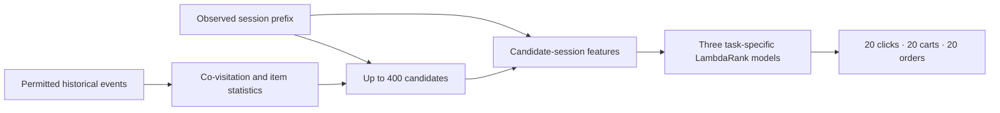
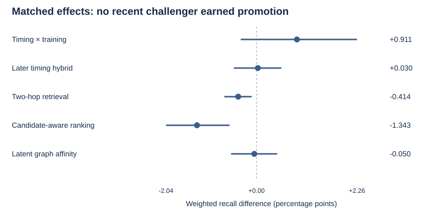

# OTTO · Session-based recommendation

**From anonymous shopping events to three ranked product lists.** A reproducible recommendation pipeline combining co-visitation retrieval, task-specific learning to rank, temporal validation, controlled feature research, and cloud batch inference.

[](https://github.com/alvaromendizabal/otto-recommender-system/actions/workflows/ci.yml)

**Delivered baseline:** 0.56842 private / 0.56862 public, accepted after the competition deadline. **Latest research review:** five completed scoring studies plus one blocked training-scale attempt, through September 21, 2026 Pacific time. No recent challenger has been promoted or submitted. [Submission provenance](docs/INFERENCE.md) · [Current research evidence](research/frontier/README.md)

## Start here

| Review path | What it demonstrates |
| --- | --- |
| [Research case study](docs/PORTFOLIO.md) | Problem framing, validation, feature selection, failure slices, engineering tradeoffs |
| [09 · Controlled feature study](notebooks/09_controlled_feature_study.ipynb) | Executed feature experiments, ablations, uncertainty and audit evidence |
| [Frontier research review](research/frontier/01_frontier_review.ipynb) | Latest matched comparisons, candidate-coverage diagnosis, negative findings and next decision; no AWS access needed |
| [05 · Two-tower results](notebooks/05_two_tower_results.ipynb) and [06 · ANN benchmark](notebooks/06_ann_benchmark.ipynb) | Objective-conditioned neural retrieval and exact/approximate nearest-neighbor experiments |
| [10 · Competition inference](notebooks/10_competition_inference.ipynb) | Frozen native-model replay and validated official-prefix batch delivery |
| [Reproducibility](docs/REPRODUCIBILITY.md) | Environments, commands, artifact prerequisites and recovery behavior |

## The task

Predict what a shopper will click, add to cart and order next, using only the observed session prefix and permitted history. The input contains product IDs, timestamps and event types, not product descriptions or user demographics. The output is three ranked lists of 20 product IDs per session.

The [organizer's task definition](https://github.com/otto-de/recsys-dataset/blob/main/KAGGLE.md) weights pooled Recall@20 as **10% clicks + 30% carts + 60% orders**. Denominators include every capped future target, including products missing from retrieval. Candidate coverage is an oracle ceiling, never an achieved recommendation score.



## Delivered system and controlled evidence

The original feature study processes **216.7 million training events**, engineers **1,482 feature formulas**, and selects **102 features**. On its **432,492-session reserved temporal cohort**, the selected model reaches **0.584392 weighted Recall@20**, versus **0.564904** for the compact ranker and **0.535244** for candidate fusion. These systems share candidates and evaluation sessions; their scores are offline results, not Kaggle scores. [Exact evaluation](reports/research/evaluation.json)


The selected representation improves on the compact ranker by **1.949 percentage points**, with a paired 95% session-bootstrap interval of **1.840 to 2.065 points**. The study uses chronological fitting, selection and evaluation roles; frozen model/feature identities; and an independent reconstruction audit. The data were previously explored, and the interval does not quantify training-seed variability. [Validation and limitations](docs/PORTFOLIO.md)

Full batch inference covers **1,671,803 official test sessions** and **5,015,409 validated prediction rows**. Its accepted score is **0.56842 private / 0.56862 public**. An earlier **0.93583** private result was invalidated after its input was found to contain future events. The corrected official-prefix result supersedes it; the incident and remediation remain documented. [Inference audit](docs/INFERENCE.md)

## Latest research: what changed and what did not

The September frontier studies tested stronger ranking schedules, objective-specific routing, two-hop retrieval, candidate-aware retraining, explicit path features and a learned 64-dimensional historical graph representation. Their matched controls generally use **134 features**, not the submitted 102-feature system.

| Study | Matched gain in weighted recall | Decision |
| --- | ---: | --- |
| Timing × training | +0.009108 | Exploratory; uncertainty includes no gain |
| Later timing hybrid | +0.000297 | Did not confirm; no promotion |
| Two-hop retrieval, unchanged rankers | −0.004137 | Coverage improved, achieved ranking regressed |
| Candidate-aware ranker with path features | −0.013429 | Reject tested recipe |
| Latent graph affinity | −0.000503 | Inconclusive; order recall declined |
| Nested training scale | Not measured | Stopped before new fitting; corrected call awaits owner rerun |

**Compare within each study only.** The cohorts differ, and these rows are not a leaderboard progression. The strongest diagnostic was a **+0.023199 candidate-coverage gain** from two-hop retrieval that did not translate into achieved recall, even after the tested retraining recipe. This publication preserves the negative results rather than presenting coverage as a win.



[Executed review notebook](research/frontier/01_frontier_review.ipynb) · [Counts, intervals and source hashes](research/frontier/evidence.json) · [Method implementations and reproduction boundaries](research/frontier/README.md)

## Engineering and publication boundaries

The repository contains the delivered pipeline, tests, selected research implementations, executed notebooks, and aggregate evidence. **AWS remains the canonical private execution workspace.** Raw events, per-session targets and predictions, full cohort ledgers, fitted models, embeddings, virtual environments and account logs are not copied into this public update.

Content-addressed inputs, atomic receipts, native-model replay, resource limits and diagnostic return bundles support restartable work. The latest scale-up attempt exposed a replay-call signature mismatch that a permissive test double missed; the strengthened test fails before the correction and passes after it. The failed attempt fitted **zero new models**, so it has no new score. [Incident and next milestone](research/frontier/README.md#training-scale-repair)

## Explore the work

The foundational notebooks cover [validation](notebooks/01_validation_protocol.ipynb), [retrieval](notebooks/02_retrieval_benchmarks.ipynb), [candidate budget](notebooks/03_candidate_frontier.ipynb), [hard negatives](notebooks/04_hard_negative_quality.ipynb), [ranking features](notebooks/07_ranking_features.ipynb) and [ranking evaluation](notebooks/08_ranking_evaluation.ipynb). Earlier owner-run source and saved outputs remain in [research/manual](research/manual/README.md).

The original [interactive Plotly report](https://github.com/alvaromendizabal/otto-recommender-system/raw/refs/heads/main/reports/portfolio/otto-research-report.zip) works offline after extraction. The new review also preserves its important figures inline; an external report is not required to inspect the findings.

Run the existing project checks from a clone:

```bash
uv sync --frozen --extra dev --extra ml
.venv/bin/python scripts/run_quality_gate.py
```

**Project status:** baseline delivery and the published research review are inspectable end to end. Performance research remains open. The historical private winning benchmark of **0.60503** has not been reached; no official rank, production-service deployment, or complete winning-solution reproduction is claimed.
