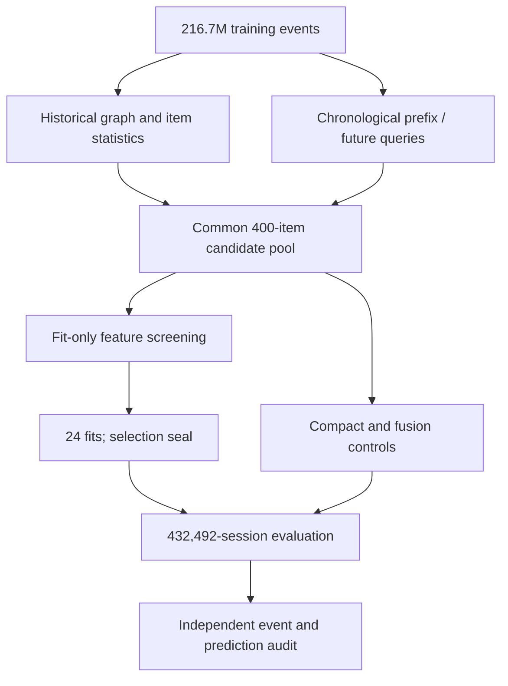

# OTTO Multi-Objective Recommender System

A reproducible machine learning project for predicting the next **click**, **cart**,
and **order** in an anonymous shopping session. It covers large-scale event processing,
co-visitation and neural retrieval, approximate nearest-neighbor search, controlled
feature research, task-specific ranking, and checkpointed SageMaker execution.

**Measured result:** a selected **102-feature LambdaRank model** achieves **0.58439
weighted Recall@20** across **432,492 temporal evaluation sessions**, compared with
**0.53524** for candidate fusion and **0.56490** for a compact ranker. The gain over
fusion is **4.915 percentage points**, with a paired 95% interval of **4.697–5.136**.

The study engineered **1,482 features**, screened them using fitting sessions only,
and compared **24 task-specific model fits**. Removing source-score features produced
the winning configuration. An independent audit reconstructed **788,883 target
records from 217 original event partitions with zero discrepancies**.

These are local temporal-validation results. The original OTTO dataset had earlier
exploratory exposure; this study refits every retrieval component before its permitted
cutoff and reserves a later evaluation cohort before selection. No leaderboard score,
state-of-the-art performance, or online business lift is claimed.

**Full notebook inference completed:** **1,671,803 competition sessions**, **5,015,409
validated rows**, and 1,633 durable prediction parts. [Execution evidence](reports/research/competition_notebook_execution.json)
and a compact native-model replay are included.

## Review the project in five minutes

| Start with | What it demonstrates |
|---|---|
| [09 — Controlled feature study](notebooks/09_controlled_feature_study.ipynb) | Research question, temporal protocol, 1,482 → 102 feature selection, matched ablations, uncertainty, explanations, cost and failure analysis |
| [10 — Competition inference](notebooks/10_competition_inference.ipynb) | Run the saved native models, reproduce example predictions, and generate the full test output through the notebook |
| [06 — Neural ANN benchmark](notebooks/06_ann_benchmark.ipynb) | Neural retrieval, exact/approximate search, candidate coverage, latency and the limits of the earlier experiment |
| [Model card](docs/MODEL_CARD.md) | Intended use, training scope, metrics, limitations and artifact lineage |

Committed notebook outputs and compact evidence support review without downloading
the dataset or accessing AWS. The default inference notebook uses a small native-model
replay; full-data mode invokes the same production inference CLI.

## What improved—and what did not

All results below use the **same 400-candidate pools and complete evaluation queries**.
The metric is `0.10 × clicks + 0.30 × carts + 0.60 × orders`, using pooled Recall@20
within each objective. Unretrievable targets remain in the denominator.

| Objective | Candidate fusion | Compact ranker · 28 features | Selected ranker · 102 features | Candidate ceiling |
|---|---:|---:|---:|---:|
| Clicks | **0.526781** | 0.457558 | 0.505645 | 0.648149 |
| Carts | **0.430211** | 0.408325 | 0.427919 | 0.569020 |
| Orders | 0.589171 | 0.661085 | **0.675753** | 0.752383 |
| **Weighted** | **0.535244** | **0.564904** | **0.584392** | **0.686951** |

Orders drive the overall improvement. Fusion still wins click and cart recall; no
post-evaluation hybrid was selected to erase those losses. The selected model's gain
over the compact control is **1.949 points** (paired 95% interval **1.840–2.065**).
Intervals are conditional on the frozen models and cohort, not training-seed uncertainty.
A candidate ceiling measures recoverable targets, not an achieved ranking score.

[Audited results](reports/research/evaluation.json) ·
[All 24 model comparisons](reports/research/ablation_models.csv) ·
[Independent audit](reports/research/audit.json)

## Research decisions backed by evidence

- **Availability before accuracy.** Historical retrieval ends on August 20, 2022;
  ranker fitting, model selection and evaluation use successive session-disjoint
  periods. Future-label timestamps and indices are retained and independently checked.
- **Broad engineering with explicit rejection.** The catalog covers graph affinity,
  recurrence, historical trends, source evidence, context and intent. Quality and
  fitting-only screening retain 128 of 1,482 formulas; selection rejects another 26
  source-family columns. Every formula, diagnostic and rejection reason is published.
- **Matched experiments.** Eight configurations share 100,000 fitting sessions,
  identical candidate pools and fitting negatives, and 20,000 full-pool selection
  sessions. All three model choices are sealed before evaluation labels are opened.
- **Explanations and cost.** Native TreeSHAP passes additivity checks. Group permutation
  diagnoses family dependence on selection queries. Warm feature-computation p95 falls
  from **22.10 ms** for the broad catalog to **6.42 ms** for the selected features on
  identical queries and hardware; this excludes model prediction and network latency.
- **Independent verification.** All published scores recompute from complete per-query
  counts. A separate auditor rebuilds every observed prefix and target from the original
  Parquet partitions and reproduces **4,608** sampled native-model/candidate checks, plus **6,912** supporting
  ranking-metric checks.

[Feature catalog](reports/research/feature_catalog.csv) ·
[Methods and protocol](docs/RESEARCH.md) ·
[Interpretation and benchmark](reports/research/interpretation.json)

## From events to a frozen experiment



The implementation lives in typed modules under `src/otto_recsys/` and the isolated
neural package `gpu/two_tower/`. Notebooks explain results and call reusable code.
The competition inference workflow refreshes historical aggregates after evaluation
while keeping the selected ranking weights frozen; its data contract is separate.

## Engineering and reproducibility

SageMaker jobs run independently of a terminal session. Atomic partition receipts,
native model checkpoints, expected S3 bucket ownership, SHA-256 verification and
workspace locks protect recovery. UTC logs and resource heartbeats expose stage and
total elapsed time. Corruption, interrupted writes, duplicate writers, missing
partitions, and resumed predictions have executable contract tests.

```bash
uv sync --frozen --extra dev --extra ml
.venv/bin/python scripts/run_quality_gate.py
.venv/bin/python scripts/project_status.py
```

For notebook replay, full experiment commands, required resources and exact dependency
locks, see [Reproducibility](docs/REPRODUCIBILITY.md). CI executes the canonical notebooks
in isolated kernels and proves verified reuse. The guarded `results/` publication
workflow commits actual notebook outputs and execution receipts after all gates pass.

[Inference workflow](docs/INFERENCE.md) · [Durability](docs/DURABILITY.md) ·
[Experiment ledger](docs/EXPERIMENT_LEDGER.md) · [Portfolio guide](docs/PORTFOLIO.md)

## Earlier experiments remain available

Notebooks [01–04](notebooks/01_validation_protocol.ipynb) document validation,
retrieval sources, candidate budgets and hard-negative construction. The
[objective-conditioned two-tower study](notebooks/05_two_tower_results.ipynb) and
[ANN benchmark](notebooks/06_ann_benchmark.ipynb) preserve their original evidence.
[07–08](notebooks/08_ranking_evaluation.ipynb) cover the earlier 30-feature,
100-candidate exploratory Fold 0 ranker: **0.373086 → 0.497317** on 103,468 sessions.
Those scores use a different cohort and are not a matched comparison with the new study.

The current research result is one fixed-seed, bounded fitting experiment on one newly
reserved temporal cohort. Repeated seeds, additional temporal cohorts, certified neural
sources in the new protocol, and online evaluation are extensions—not measured claims.
