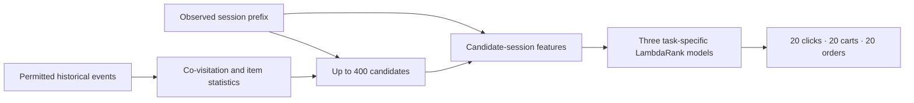
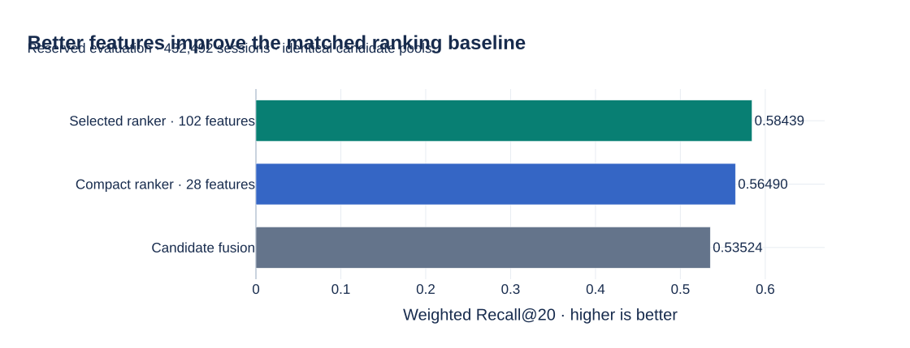

# OTTO · Session-based recommendation

**From anonymous shopping events to three ranked product lists.** An end-to-end recommendation project combining co-visitation retrieval, task-specific learning to rank, temporal validation, controlled feature research, and cloud batch inference.

[](https://github.com/alvaromendizabal/otto-recommender-system/actions/workflows/ci.yml)

**Current verified result:** **0.57586 private / 0.57601 public** on submission **56542128**, scored after the competition deadline. The public research frontier now emphasizes two things at once: broader modeling capability and stronger validation integrity. Source-aware ranking, contextual models, candidate-conditioned sequence interaction and leakage-safe heterogeneous OOF ensembling have all been exercised. A later validation-integrity audit found that the newest click/cart stack had been compared with an incomplete reconstruction of the deployed objective-specific routing policy, so that stack has been returned to **research / reconciliation** status rather than presented as a promoted result. The externally scored similarity-order system remains the verified champion while the comparator is reconstructed and re-audited. [Validation integrity update](research/frontier/11_validation_integrity_reconciliation.md) · [Submission provenance](docs/INFERENCE.md)


## Start here

| Review path | What it demonstrates |
| --- | --- |
| [Research case study](docs/PORTFOLIO.md) | Problem framing, validation, feature selection, failure slices and engineering tradeoffs |
| [09 · Controlled feature study](notebooks/09_controlled_feature_study.ipynb) | Executed comparisons, ablations, uncertainty and audit evidence |
| [Frontier research review](research/frontier/01_frontier_review.ipynb) | Five completed scoring studies, candidate-coverage diagnosis and decisions |
| [Training scale and recovery](research/frontier/02_training_scale_status.ipynb) | Larger training support, model sealing and checkpoint recovery; later completed and bridged to the established pipeline |
| [03 · Neural frontier](research/neural_stack/03_neural_stack_status.ipynb) | Dated neural-design snapshot and first-place sequence-retrieval adaptation |
| [04 · Competition frontier](research/frontier/04_competition_frontier.ipynb) | Executed September 23 scorecard: verified leaderboard progression and closed hypotheses at that snapshot |
| [05 · Similarity + attention frontier](research/frontier/05_similarity_attention_frontier.md) | Promoted 0.57586 similarity result and the first complementary-attention study |
| [06 · Transition + model frontier](research/frontier/06_transition_model_frontier.md) | Dense-interaction closeout, transition/source features and model-family diversification |
| [07 · Candidate + model frontier](research/frontier/07_candidate_model_frontier.md) | MF/W2V/Seq2Seq candidate work, broad third-place recreation and CPU closeouts |
| [08 · Neural + objective frontier](research/frontier/08_neural_objective_frontier.md) | Full first-place neural mechanism sweep, order-side source/sequence closeouts and the fitting-qualified click/cart challenger |
| [09 · Click/cart selection protocol](research/frontier/09_click_cart_selection_protocol.md) | Frozen source-aware selection design and the independently measured transfer decision |
| [10 · Contextual, sequence + ensemble validation](research/frontier/10_contextual_sequence_stack_validation.md) | Dated contextual/sequence/ensemble snapshot retained for provenance; superseded promotion interpretation is explicitly corrected |
| [11 · Validation integrity + comparator reconciliation](research/frontier/11_validation_integrity_reconciliation.md) | How deployment-parity auditing caught a comparator mismatch, preserved the scientific record and blocked an unqualified release |
| [05 · Two-tower results](notebooks/05_two_tower_results.ipynb) and [06 · ANN benchmark](notebooks/06_ann_benchmark.ipynb) | Objective-conditioned neural retrieval and nearest-neighbor experiments |
| [10 · Competition inference](notebooks/10_competition_inference.ipynb) | Frozen native-model replay and verified official-prefix batch delivery |

## The task and architecture

Predict what a shopper will click, add to cart and order next, using only the observed session prefix and permitted history. Input consists of product IDs, timestamps and event types, not product descriptions or user demographics. Output is three ranked lists of 20 products per session.

The [organizer's metric](https://github.com/otto-de/recsys-dataset/blob/main/KAGGLE.md) weights pooled Recall@20 as **10% clicks + 30% carts + 60% orders**. Denominators include capped future targets missing from retrieval. Candidate coverage is an oracle ceiling, never an achieved recommendation score.


```mermaid
flowchart LR
    H[Permitted historical events] --> G[Co-visitation and item statistics]
    P[Observed session prefix] --> C[Up to 400 candidates]
    G --> C
    P --> F[Candidate-session features]
    C --> F
    F --> R[Three task-specific LambdaRank models]
    R --> O[20 clicks · 20 carts · 20 orders]
```

## Delivered system and controlled evidence

The original feature study processes **216.7 million training events**, engineers **1,482 feature formulas**, and selects **102 features**. On its **432,492-session reserved temporal cohort**, the selected model reaches **0.584392 weighted Recall@20**, versus **0.564904** for the compact ranker and **0.535244** for candidate fusion. These systems share candidates and evaluation sessions. These are offline results, not Kaggle scores. [Exact evaluation](reports/research/evaluation.json)



The selected representation improves on the compact ranker by **1.949 percentage points**, with a paired 95% session-bootstrap interval of **1.840 to 2.065 points**. Chronological fitting, selection and evaluation roles, frozen artifact identities, and a reconstruction audit support the comparison. Previously explored data and training-seed uncertainty remain limitations. [Validation and failure slices](docs/PORTFOLIO.md)

Full batch inference covers **1,671,803 official test sessions** and **5,015,409 validated prediction rows**. The frozen 102-feature reference scored **0.56842 private / 0.56862 public**. The objective router moved to **0.57100 / 0.57121**, and the long-session cart router reached **0.57140 / 0.57166**. The promoted similarity-stack submission **56542128** preserves the long-session router's click/cart lists and replaces orders with a task-specific 137-feature ranker that combines the established representation with learned candidate-to-session similarity and neural-query diagnostics; it reaches **0.57586 private / 0.57601 public**. All are post-deadline measurements; none establishes an official medal or rank. [Inference and provenance](docs/INFERENCE.md)

## Research: test mechanisms, measure outcomes, preserve decisions

The recent studies test timing/training interactions, objective-specific routing, multi-hop retrieval, candidate-aware ranking, explicit path features and learned graph affinities. Their matched controls generally use **134 features**, not the submitted 102-feature system.

The two-hop mechanism increased candidate coverage by **0.023199**, but achieved recall declined. Its tested retraining recipe also regressed. The later timing hybrid and latent-affinity experiments did not establish transferable gains. These findings remain visible in the [executed comparison notebook](research/frontier/01_frontier_review.ipynb), alongside counts, intervals and [selected method implementations](research/frontier/README.md). Different cohorts must not be read as a leaderboard progression.

**Frontier progression:** after the promoted v42-derived similarity stack, the project systematically broadened its modeling capabilities instead of repeatedly tuning the incumbent. Transition/XGBoost, candidate expansion, Word2Vec, lag-Seq2Seq, broad third-place-inspired features, the remaining first-place neural variants, flat heterogeneous source fusion, and QueryFormer-style order interaction were all evaluated under frozen gates and closed when they did not transfer. The strongest click/cart source-aware tree result then passed fitting but failed independent selection because click gains did not transfer to carts. That negative transfer motivated contextual routing and candidate-conditioned sequence models; neither passed standalone, but their preserved OOF predictions enabled a heterogeneous ensemble with strong fitting evidence. A subsequent deployment-parity audit identified that later click/cart validation had used an incomplete comparator reconstruction rather than the exact deployed routing policy. The project therefore **withdrew the promotion interpretation, preserved the artifacts, and blocked further deployment until comparator reconciliation completes**. This correction is intentionally public: catching and containing validation drift is part of the engineering result. [Validation integrity update](research/frontier/11_validation_integrity_reconciliation.md) · [Reproduction matrix](research/neural_stack/reproduction_matrix.json)

## Engineering and publication boundaries

**AWS is the canonical private execution workspace; GitHub is the curated review surface.** The public update includes executed notebooks, aggregate evidence, readable selected implementations and tests. It does not copy raw events, per-session labels or predictions, cohort IDs, full models, embeddings, environments, credentials or account logs.

Content-addressed inputs, atomic receipts, native-model replay, resource bounds and return bundles make long workflows inspectable and restartable. Later frontier runs extend that discipline to reusable neural checkpoints, fitting caches, per-part evaluation receipts, one-upload submission ledgers and explicit stop decisions. Engineering failures are recorded separately from model-quality failures. The similarity deployment required several engineering recoveries before producing a fully validated score; the fixed XGBoost branch later completed selection and was rejected scientifically rather than presented as a gain. The public repository reports aggregate outcomes and reproducibility contracts, not private checkpoints or row-level predictions.

## Explore and inspect

Foundational notebooks cover [validation](notebooks/01_validation_protocol.ipynb), [retrieval](notebooks/02_retrieval_benchmarks.ipynb), [candidate budgets](notebooks/03_candidate_frontier.ipynb), [hard negatives](notebooks/04_hard_negative_quality.ipynb), [ranking features](notebooks/07_ranking_features.ipynb) and [ranking evaluation](notebooks/08_ranking_evaluation.ipynb). Earlier manual research remains in [research/manual](research/manual/README.md). [Environment and artifact requirements](docs/REPRODUCIBILITY.md)

Important findings are embedded in the saved notebooks as inline Plotly figures and static fallbacks. The [original portable report](https://github.com/alvaromendizabal/otto-recommender-system/raw/refs/heads/main/reports/portfolio/otto-research-report.zip) is supplementary, not a replacement for notebook evidence.

```bash
uv sync --frozen --extra dev --extra ml
.venv/bin/python scripts/run_quality_gate.py
```

**Scope:** the delivered reference system and verified post-competition submission lineage are complete and inspectable. Current research emphasizes controlled transfer, heterogeneous OOF ensembling, independent validation and deployment-parity auditing. The newest click/cart stack has **strong fitting evidence but is not currently promoted**: a comparator reconstruction issue was discovered during official-inference parity work and the project is reconciling that comparison before any further release decision. No newer competition submission, official rank, medal, production-service deployment, or state-of-the-art claim is made.
