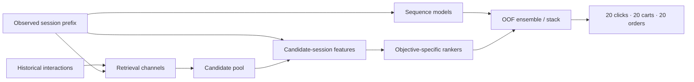

# OTTO · Session-based recommendation

**An end-to-end recommender research system for predicting clicks, carts, and orders from anonymous shopping sessions.**

[](https://github.com/alvaromendizabal/otto-recommender-system/actions/workflows/ci.yml)

**Current verified Kaggle result:** **0.57586 private / 0.57601 public** on submission **56542128** (post-competition scoring).

This project has grown from a classical learning-to-rank baseline into a disciplined multi-stage recommender research platform spanning co-visitation retrieval, objective-specific LambdaRank, neural sequence representations, source-aware ranking, contextual routing, target-aware cross-attention, leakage-safe heterogeneous OOF stacking, uncertainty-aware promotion gates, and resumable GPU/CPU evaluation.

**Current research state:** a heterogeneous sequence stack passed fitting and a fresh independent 20,000-session selection stage. Final Reserve V2 is now active with **200,000 / 412,492 sessions** and **4 / 9 deterministic prediction shards** sealed while labels remain unopened.

[Current frontier](research/frontier/README.md) · [Fresh selection + reserve protocol](research/frontier/12_reserved_evaluation_v2.md) · [Reproducibility](docs/REPRODUCIBILITY.md)

---

## Why this repository stands out

| Capability | Evidence |
| --- | --- |
| **Large-scale data engineering** | 216.7M training events, 1.67M test sessions, 5.0M validated submission rows |
| **Feature research** | 1,482 engineered formulas narrowed to a 102-feature production-grade reference representation |
| **Ranking systems** | Objective-specific LightGBM LambdaRank, XGBoost, fixed blends, contextual neural rerankers, OOF stackers |
| **Neural recommenders** | Task-conditioned sequence encoders, attention variants, candidate/session similarity, candidate-conditioned sequence attention |
| **Validation discipline** | Chronological roles, frozen gates, fresh selection cohorts, paired bootstrap intervals, label embargoes |
| **Engineering quality** | Content-addressed artifacts, deterministic manifests, checkpoint/resume, one-return execution bundles, GPU/CPU environment isolation |
| **Research maturity** | Positive and negative experiments are both preserved; near-threshold ideas are not promoted after the fact |
| **Cloud execution** | AWS/SageMaker is the canonical research environment; GitHub is a curated employer-facing evidence layer |

---

## Start here

| Review path | What it demonstrates |
| --- | --- |
| [Portfolio case study](docs/PORTFOLIO.md) | Problem framing, validation design, feature selection, failure analysis, and engineering tradeoffs |
| [Controlled feature study](notebooks/09_controlled_feature_study.ipynb) | Executed ablations, uncertainty, and audit evidence |
| [Frontier research](research/frontier/README.md) | Mechanism-by-mechanism research progression and frozen decisions |
| [08 · Neural + objective frontier](research/frontier/08_neural_objective_frontier.md) | Eight-model neural-family coverage and objective-specific click/cart ranking |
| [09 · Click/cart selection](research/frontier/09_click_cart_selection_protocol.md) | Independent selection result and the decision to close the original source-aware joint recipe |
| [10 · Contextual + sequence frontier](research/frontier/10_contextual_and_sequence_frontier.md) | CRAFT routing and candidate-conditioned temporal sequence modeling |
| [11 · Heterogeneous OOF stack](research/frontier/11_heterogeneous_stack_and_fresh_selection.md) | Leakage-safe stack promotion and fresh selection |
| [12 · Final Reserve V2](research/frontier/12_reserved_evaluation_v2.md) | Sharded, label-blind final reserve prediction protocol and active checkpoint state |
| [Competition inference](notebooks/10_competition_inference.ipynb) | Frozen native-model replay and validated large-batch delivery |

---

## Task and metric

Given only the observed prefix of a session—product IDs, timestamps, and event types—the system predicts three ranked lists of 20 products:

- clicks
- carts
- orders

The official metric is pooled **Weighted Recall@20**:

**0.10 × clicks + 0.30 × carts + 0.60 × orders**

Candidate coverage is treated as an oracle ceiling, never as achieved recommendation quality.


```mermaid
flowchart LR
    H[Historical interactions] --> R[Retrieval channels]
    P[Observed session prefix] --> R
    R --> C[Candidate pool]
    P --> F[Candidate-session features]
    C --> F
    F --> T[Objective-specific rankers]
    P --> S[Sequence models]
    S --> E[OOF ensemble / stack]
    T --> E
    E --> O[20 clicks · 20 carts · 20 orders]
```

---

## Delivered baseline and verified submission lineage

The foundational system processes **216.7 million training events**, engineers **1,482 feature formulas**, and selects **102 features**.

On a **432,492-session temporal evaluation cohort**:

- compact ranker: **0.564904**
- selected system: **0.584392**
- improvement: **+1.949 percentage points**
- paired 95% session-bootstrap interval: **+1.840 to +2.065 points**

The official test pipeline covers:

- **1,671,803 sessions**
- **5,015,409 prediction rows**

Verified post-competition Kaggle progression:

| System | Private | Public |
| --- | ---: | ---: |
| Frozen 102-feature reference | 0.56842 | 0.56862 |
| Objective router | 0.57100 | 0.57121 |
| Long-session cart router | 0.57140 | 0.57166 |
| **Neural-similarity order system** | **0.57586** | **0.57601** |

The promoted similarity model preserved the click/cart policy and upgraded orders with learned candidate-to-session similarity, adding **+0.004396 weighted Recall@20 and +508 order hits** on reserved temporal evaluation.

---

## Research progression

### 1. Candidate and representation research

The project independently adapted and evaluated mechanisms from strong public OTTO solutions, including:

- weighted and directional co-visitation
- matrix-factorization retrieval
- action-specific Word2Vec
- lag-conditioned sequence retrieval
- neural sequence retrieval
- candidate/session similarity aggregates
- source presence, rank, score, and consensus features
- broad popularity and temporal context
- LightGBM, XGBoost, fixed blends, and leakage-safe OOF stacking

Useful mechanisms were reimplemented inside the project's own point-in-time pipeline rather than copied as predictions or checkpoints.

### 2. Neural-family coverage

The v15/v18/v21/v23/v27/v29/v31/v42 mechanism family was materially covered through bounded experiments.

The key transfer was not a direct neural reranker—it was **representation reuse**: v42-derived sequence embeddings became similarity evidence inside the established ranking system and were promoted after passing selection and reserved evaluation.

### 3. Objective-specific click/cart ranking

A 589-feature source-aware ranker on the stable 400-candidate pool produced a strong fitting result:

- clicks: **+186 hits**
- carts: **+53 hits**
- combined weighted gain: **+0.003535**
- chronological fitting folds: **5/5 positive**

Independent selection later showed a critical interaction effect: click ranking improved, but cart ranking regressed. The joint recipe was closed instead of tuned on the opened selection set.

### 4. Contextual routing and sequence interaction

The project then tested two materially different nonlinear families:

- **CRAFT-style contextual/reliability-aware transport**
- **candidate-conditioned temporal sequence attention**

CRAFT was rejected scientifically after 20 GPU fits. The sequence family completed another **20 GPU fits**, and its strongest DIN-style long-session arm was stable and materially improved carts, but remained below the frozen combined promotion threshold.

Those models were retained as complementary OOF signals.

### 5. Heterogeneous OOF stacking

Nine heterogeneous OOF rankers were combined with fixed and learned stackers.

The selected fitting stack, **`zmean_seq__all`**, achieved:

- **+0.004203** deployment-aligned combined gain
- **+64 cart hits**
- **5/5 nonnegative combined folds**
- **5/5 nonnegative cart folds**
- worst combined fold: **+0.002071**

It then passed a fresh independent selection stage:

- combined gain: **+0.003194**
- clicks: **+136 hits**
- carts: **+47 hits**
- paired 95% interval: **[+0.001865, +0.004554]**
- both chronological halves positive

### 6. Final Reserve V2 — active

The promoted stack is now being frozen over a **412,492-session final reserve** using deterministic chronological prediction shards.

Current state:

- **200,000 / 412,492 sessions predicted**
- **4 / 9 shards sealed**
- reserve labels remain **unopened**
- prediction preparation is resumable and hash-verified

The complete reserve labels are opened only after every shard is frozen.

---

## Engineering discipline

The research workflow is intentionally stricter than a typical competition notebook:

- AWS/SageMaker is the canonical execution environment
- long stages checkpoint and resume instead of restarting
- transient high-volume caches use NVMe
- model/prediction artifacts are content-addressed
- every major run writes immutable provenance
- CPU and CUDA runtimes are isolated to avoid fork/native-runtime failures
- child-process environments are capability-checked
- inference uses explicit no-grad/inference mode
- label access is staged and frozen
- negative results remain in the research record
- reporting failures are distinguished from scientific failures
- private row-level predictions, checkpoints, cohort IDs, and orchestration remain outside GitHub

---

## Public/private boundary

This repository is intentionally **semi-reproducible**.

Public:

- aggregate metrics
- validation contracts
- selected readable implementations
- executed notebooks
- source attribution
- experiment decisions
- tests and reproducibility rules

Private in AWS:

- raw competition data
- row-level labels and predictions
- exact cohort/session IDs
- full model checkpoints
- embedding tables
- optimizer state
- private runners
- cloud credentials and account metadata
- exact competitive orchestration

---

## Reproduce the public review

```bash
uv sync --frozen --extra dev --extra ml
.venv/bin/python scripts/run_quality_gate.py
```

The public repository is a curated engineering/research review surface, not a dump of private competition state.