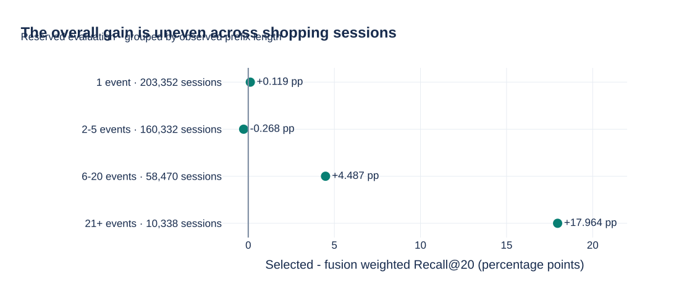
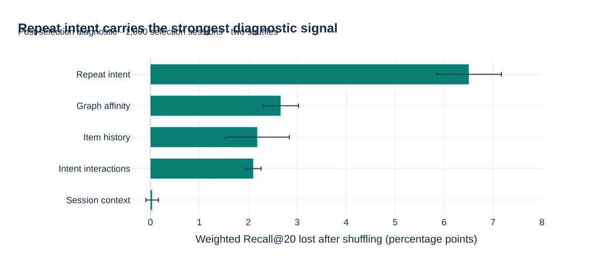
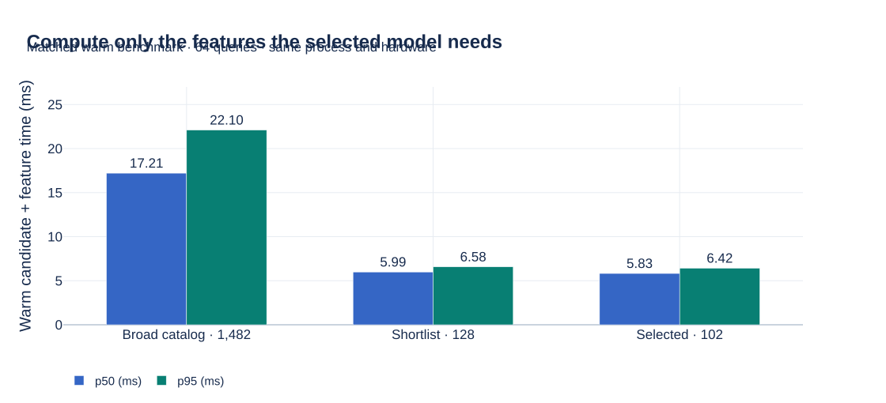

# OTTO research case study

**How do you turn anonymous shopping events into useful recommendations—and demonstrate
that the improvements are real?**

This project builds a complete session recommender, studies its feature representation
under controlled conditions, and carries the selected models through full competition
inference. The key result is **0.584392 weighted Recall@20** on **432,492 reserved temporal
sessions**, versus **0.564904** for a compact ranker and **0.535244** for fixed candidate fusion.

[Project overview](../README.md) ·
[Executed research notebook](../notebooks/09_controlled_feature_study.ipynb) ·
[Interactive Plotly report · ZIP ↓](https://github.com/alvaromendizabal/otto-recommender-system/raw/refs/heads/main/reports/portfolio/otto-research-report.zip) ·
[Model card](MODEL_CARD.md)

Download the ZIP above, extract it, and open `otto-research-report.html` in a browser.
The report includes Plotly and works offline. The figures below are SVG exports of those same chart definitions.
Their values come from the checked-in experiment reports, not manually entered chart data.

## What is being predicted?

The input is the part of a shopping session already observed: product IDs, event times,
and whether each action was a click, a cart addition, or an order. This observed portion
is the **prefix**. Everything after the prediction point is future information and belongs
to the targets, not the input features.

For an illustrative session, a shopper could click product A, click B, and add A to a
cart. The recommender sees those three events and ranks products for each future action.
It cannot inspect what the shopper later buys. This example explains the task; it is
not a hand-picked success case from the evaluation set.

The training source contains **216,716,096 events**. The challenge is to extract useful
behavioral structure at this scale while ensuring that each experiment sees only the
information available at its prediction time. Product descriptions, images, demographic
profiles, and persistent customer identities are not inputs to this study.

## How to read the score

A recommendation list has 20 slots. **Recall@20 asks how much of the relevant future
activity the list recovers.** For clicks, the target is the next click. For carts and
orders, targets are the distinct products involved in the corresponding future actions.
The official denominator for each query is capped at 20 targets.

The metric pools counts within an action. Consider a small, hypothetical cart example:

| Session | Future cart products | Products recovered in the top 20 | Hits | Capped target count |
|:---|:---|:---|---:|---:|
| A | P, Q, R | P, Q | 2 | 3 |
| B | S | S | 1 | 1 |
| **Pooled** | | | **3** | **4** |

The cart recall is **3 / 4 = 0.75**. It is not the average of 2/3 and 1. A target that
never enters the candidate pool is still missing from the recommendation list and stays
in the denominator. Queries are not discarded because they are difficult.

The three pooled recalls are combined as:

$$
\text{Weighted Recall@20}
= 0.10 \times R_{\text{clicks}} + 0.30 \times R_{\text{carts}} + 0.60 \times R_{\text{orders}}.
$$

For the selected model, the measured recalls are 0.505645, 0.427919, and 0.675753. Applying
the official weights yields **0.584392**. This is a retrieval-and-ranking metric: it is
not classification accuracy, a purchase probability, or an estimate of revenue lift.
[Official specification](https://github.com/otto-de/recsys-dataset/blob/main/KAGGLE.md) ·
[Metric counts](../reports/research/evaluation.json)

## Why retrieval and ranking are separate

Scoring every catalog product with a rich model for every session would be costly.
The system therefore answers two questions in sequence.

**Retrieval asks which products deserve consideration.** A co-visitation graph links
products that appear near each other in historical sessions. Multiple channels emphasize
general transitions, cart activity, and purchase intent. Products revisited in the current
session and popular historical items provide additional candidates. These sources produce
a common pool of up to 400 products.

**Ranking asks which candidates belong near the top.** Each candidate gets a structured
feature vector. Separate click, cart, and order models reorder the pool into three lists.
LambdaRank learns from comparisons among candidates within a query, so it is suited to
an ordered recommendation task. Product IDs identify candidates; their raw numeric values
are not treated as meaningful continuous model features.

The repository's earlier neural study learns session and product representations with an
objective-conditioned two-tower model. Its ANN benchmark compares exact and approximate
search fidelity, coverage, and latency. This demonstrates a second retrieval strategy.
Those results keep their original experimental scope: the newer controlled study refits
its own historical retrieval and does not reuse the earlier neural checkpoint.
[Two-tower results](../notebooks/05_two_tower_results.ipynb) ·
[ANN benchmark](../notebooks/06_ann_benchmark.ipynb)

## How the experiment prevents future information from leaking in

A random event split could place a shopper's earlier and later actions on opposite sides
of a split while letting aggregate features see both. It could also let a historical graph
contain relationships learned from future target events. The study uses chronological,
session-disjoint roles instead.

| Role | Data boundary, UTC | Permitted use |
|:---|:---|:---|
| Historical events | Before Aug 20, 2022, 22:00 | Fit graph connections and item statistics |
| 100,000 fitting sessions | Aug 20, 22:00 to Aug 23, 22:00 | Screen features and fit models |
| 20,000 selection sessions | Aug 23, 22:00 to Aug 24, 22:00 | Choose feature variants and stopping iterations |
| 432,492 evaluation sessions | Aug 24, 22:00 to Aug 26, 22:00 | Measure the frozen choice |

The start of a window is included; its end is excluded. A session's first event determines
its role, and its events are clipped at that role's end. Eligible sessions must have enough
events to form both an observed prefix and future targets. Session inclusion and the prefix
cut are deterministic and label-independent.

Feature availability is explicit. Repeat counts and session duration use the observed
prefix. Historical counts and graph connections end at the historical cutoff. Future
labels retain timestamps and event indices so an auditor can verify that they occur after
the prefix. The model-selection record is sealed before evaluation labels are consulted.

These controls apply to the new experiment. The underlying OTTO dataset had prior
exploratory exposure, so the evaluation is described as **newly reserved**, not as data
that had never been inspected. [Complete protocol](RESEARCH.md#availability-and-evaluation)

## What the feature research tests

The search covers **1,482 candidate formulas across six families**. Its size comes from
systematic variations of plausible mechanisms—for example, graph channels, action filters,
prefix lengths, recency weights, and aggregation rules. It is followed by aggressive screening.

| Mechanism | Example of an actual retained feature | Interpretation and availability |
|:---|:---|:---|
| Recent demand | `hist_all_h1_share` | The share of an item's historical activity in the last hour before the fixed history cutoff |
| Shopping context | `query_duration_hours` | How long the observed prefix spans; future session duration is unavailable |
| Repeat interest | `repeat_all_n5_count` | How often the candidate appears in the last five observed events |
| Basket affinity | `graph_cart_all_n5_uniform_max` | The strongest cart-channel connection from the last five observed events to the candidate |
| Combined intent | `intent_repeat_carts` | Candidate repeat count combined with the historical cart-to-click ratio |

The first broad feature matrix contains **514,013 rows from 8,448 fitting sessions**.
The nominal 500,000-row screening budget is exceeded only to preserve complete query batches.
Quality checks reject 54 constants, five near-constants, and 146 duplicates. Three
session-grouped folds train action-specific binary pilot models to diagnose feature utility
and stability. These pilots are inexpensive screening tools; their scores are not presented
as final ranking performance.

Correlation pruning rejects another 31 columns. The retention budget excludes 1,118 more,
leaving a shortlist of **128**. This last category means lower priority under the declared
budget, not proof that the feature can never help. The full fitting cache then contains
**6,083,582 sampled candidate rows across 100,000 sessions**. Selection uses all **8,000,000
candidate rows** across its 20,000 sessions.

Selection removes 26 direct source-family columns, leaving **102 final features** and
**1,380 candidates not present in the final representation**. The surviving counts are
57 history, 19 context, 17 repeat, five graph, and four interaction features.
A larger feature count is not the objective: measured ranking quality and justified
complexity are. [All formulas, diagnostics, and rejection reasons](../reports/research/feature_catalog.csv)

## What the ablation actually shows

An **ablation** removes a component and measures the resulting change. Here, a compact
28-feature control, the full 128-feature shortlist, and six leave-one-family-out variants
share fitting sessions, candidates, sampled negatives, LightGBM settings, and the stopping
rule. Three objectives per configuration produce **24 native model fits**.

| Configuration | Features | Selection weighted Recall@20 |
|:---|---:|---:|
| Compact control | 28 | 0.575687 |
| Full shortlist | 128 | 0.576403 |
| Remove session context | 109 | 0.577339 |
| Remove graph affinity | 123 | 0.574379 |
| Remove item history | 71 | 0.573279 |
| Remove intent interactions | 124 | 0.575936 |
| Remove repeat intent | 111 | 0.574781 |
| **Remove direct source features** | **102** | **0.599523** |

**The largest measured selection improvement comes from removing direct source features.**
That variant also wins the individual click, cart, and order selection comparisons.
The chosen models contain 40, 60, and 95 boosting iterations, respectively.

One possible explanation is that direct retrieval scores offer a shortcut that does not
transfer as well as other behavioral features. That is a hypothesis, not an established
mechanism. The experiment establishes the effect of refitting these tested configurations
under the declared selection procedure. Feature dependencies and changes in the selected
stopping iteration prevent interpreting the bars as independent causal feature effects.

Context removal also helps the full reference slightly, yet context remains in the winning
source-removed model. There is no contradiction: these are different conditional comparisons.
The source-and-context joint removal was not separately trained. The current evidence supports
a bounded, auditable stopping decision for this study; it does not prove every possible
feature combination has been exhausted.
[Full task-specific model ledger](../reports/research/ablation_models.csv)

## What improved on the reserved evaluation

The selected ranker scores **0.584392**, compared with **0.564904** for the compact control.
That is **+1.949 percentage points** under matched training settings and the same stopping
rule. Because the learning algorithm and candidate pools are held fixed, this comparison
supports the value of the feature representation and its selection procedure. It does not
separate each feature's individual effect or hold the selected number of trees constant.

Compared with candidate fusion, the gain is **+4.915 points**. This second comparison includes
the effect of learned ranking as well as its features, so it should not be attributed solely
to feature engineering. The final evaluation gain is also distinct from the source-removal
gain measured on the earlier selection cohort.

Paired session bootstrap intervals use the same resampled sessions for both models in a
comparison. Across 1,000 replicates, the 95% gain interval is **+1.840 to +2.065 points** over
the compact model and **+4.697 to +5.136 points** over fusion. These intervals quantify
sampling variation conditional on the frozen models and this period. Multiple training
seeds and future time periods could reveal additional variation.

## Where the system struggles

Fusion still wins click and cart Recall@20. The selected model's order recall is much higher,
and orders receive 60% of the official weighted metric. This explains how the weighted
score can improve without winning every objective. No action-specific hybrid was chosen
after examining these evaluation scores.

Supporting metrics describe another aspect of ranking quality. The selected model's
order **NDCG@20 is 0.694343** and **MRR@20 is 0.737514**, versus fusion's 0.335239 and 0.264069.
NDCG rewards placing relevant items near the top; MRR emphasizes the first relevant result.
These diagnostics help explain ordering quality, while weighted Recall@20 remains the
primary measure. Model scores are not calibrated probabilities, so probability calibration
is not claimed.

The 2–5 event group loses **0.268 points** to fusion. The 21+ event group gains **17.964 points**,
but contains only **10,338 sessions**. Reading group sizes alongside scores prevents an
impressive slice from standing in for the whole population. These are descriptive slices,
not independently selected models or estimates with separately measured confidence intervals.

Retrieval also imposes a limit. At a 400-item budget, the weighted candidate ceiling is
**0.686951**, above the achieved 0.584392. Missing candidates cannot be rescued by ranking,
and imperfect ranking leaves additional room below the ceiling. The ceiling is an idealized
coverage calculation, not an attained model score.

## What the explanations establish

TreeSHAP explains how the trained trees combine feature contributions into a ranking score.
The study checks this additivity on **4,096 selection candidate rows**, with maximum errors
around floating-point precision. Contributions explain the model's scores; they do not
explain a causal probability of purchase. The full action-specific feature charts appear
in [Notebook 09](../notebooks/09_controlled_feature_study.ipynb).

A complementary diagnostic keeps the selected model fixed and shuffles a feature family
between whole query blocks. If recall drops, the model depended on that information in
this sample. Repeat intent produces the largest mean drop, followed by graph affinity,
history, and interactions. Session context has a small, mixed effect across the two shuffles.

This diagnostic uses **1,000 selection sessions**, not the final evaluation labels.
Whiskers span two shuffles. Shuffling can create combinations that would not occur naturally,
so the result measures model dependence under perturbation, not a causal effect or an
additive allocation of the total performance gain.
[Interpretation evidence](../reports/research/interpretation.json)

## What the runtime measurement means

A broad search can be useful during research without materializing every feature in final
inference. The feature engine computes the selected schema directly.

On **64 matched selection queries**, warm candidate generation plus feature computation
has p95 **22.10 ms** for all 1,482 formulas, **6.58 ms** for the shortlist, and **6.42 ms** for
the selected 102 features. The selected computation is about **71% lower at p95** than
materializing the entire catalog on this machine.

This is a local component benchmark in one process. It excludes model prediction,
networking, cold starts, concurrent traffic, and online serving. It demonstrates that
feature selection reduces unnecessary computation; it is not a production latency SLA.

## How the evidence can be checked

The separate auditor rebuilds the observed prefixes and **788,883 target records** from
**217 original Parquet partitions**. Bidirectional comparisons find zero differences.
It verifies all 24 native model digests and the selection rule, pools complete evaluation
counts, and replays a deterministic sample of 256 sessions with separate metric arithmetic.
That sample yields **4,608 primary prediction/candidate checks** and **6,912 supporting
ranking-metric checks**, with zero mismatches.

This has a defined boundary: the auditor shares the frozen feature implementation and
tracks the original raw JSONL identity without independently replaying the raw-to-Parquet
conversion. The published evidence therefore supports those exact audit claims.

The portfolio figures have their own reproducible build. It checks the research manifest,
model lineage, weighted-score arithmetic, paired gains, and family counts before generating
Plotly charts. A figure receipt binds the generator, dependency lock, evidence manifest,
and each output's checksum. CI checks committed figures against the current evidence and
rerenders previews for inspection. [Generator](../scripts/build_portfolio_figures.py) ·
[Auditor](../src/otto_recsys/research/audit.py) · [Reproduction guide](REPRODUCIBILITY.md)

## What the engineering deliverable demonstrates

The full batch workflow generated **5,015,409 validated rows** for **1,671,803 competition
sessions**. Each session appears once for clicks, carts, and orders, with 20 unique product
IDs per row. The completed artifact is `submission.csv.gz`; the small `inference_replay.csv`
is a 24-row review example and is not the full submission.

The final ranking weights stay frozen for deployment. Historical aggregates and graph
connections are then refreshed from the permitted full training history. This is a separate
deployment data contract, and its predictions are not assigned the earlier offline score.
Kaggle upload and scoring remain separate from producing and validating the file.
[Inference notebook](../notebooks/10_competition_inference.ipynb) · [Completed output](INFERENCE.md)

Long jobs run in SageMaker with UTC stage logs and heartbeats. Model checkpoints and
partition receipts persist to S3. Restored objects must match their expected owner, input
identity, and SHA-256. Atomic writes and workspace locks protect against partial files
and competing writers. Tests exercise interruption, corruption, missing partitions,
changed contracts, and exact reuse on real small model fits.

| Capability | Concrete place to inspect it |
|:---|:---|
| Scientific judgment | [Controlled study](../notebooks/09_controlled_feature_study.ipynb), including negative findings and scoped uncertainty |
| Feature engineering | [Feature implementation](../src/otto_recsys/research/features.py) and [complete catalog](../reports/research/feature_catalog.csv) |
| Ranking | [Training](../src/otto_recsys/research/training.py) and [model selection](../src/otto_recsys/research/study.py) |
| Neural retrieval | [Two-tower package](../gpu/two_tower) and [executed results](../notebooks/05_two_tower_results.ipynb) |
| Approximate search | [ANN benchmark](../notebooks/06_ann_benchmark.ipynb) |
| Data and evaluation integrity | [Temporal corpus](../src/otto_recsys/research/protocol.py) and [independent audit](../src/otto_recsys/research/audit.py) |
| MLOps and recovery | [Cloud orchestration](../src/otto_recsys/cloud), [checkpoint storage](../src/otto_recsys/cloud/research_checkpoints.py), and [CI](../.github/workflows/ci.yml) |

## What remains an open research question

The [frozen robustness study](ROBUSTNESS.md) has verified all three reference-window
seeds. The feature gain stays positive at **+1.949, +2.022 and +2.031 percentage points**;
all three select the same 102-feature representation. This supports seed consistency
on one period. The next bounded research work is to build and audit **the early temporal
window**, then the middle window, each with its three planned seeds.

After those comparisons, evaluate a predeclared action-specific hybrid on a fresh
selection/evaluation split. Joint feature-family removals and neural retrieval certified to
the same historical boundary are additional experiments, not completed results.

The present evidence supports a substantial, reproducible offline study and a complete
batch inference implementation. It does not establish cross-period universality, a novel
model architecture, a leaderboard rank, or online revenue lift. Those limits make the
conclusions testable and the next experiments clear.
